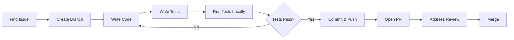

# Caro Contributor Onboarding Guide

**Purpose**: Welcome and onboard new contributors to the caro project
**Audience**: First-time contributors, regular contributors, potential maintainers
**Goal**: Make first contribution easy, enjoyable, and successful

---

## Welcome! 🎉

Thank you for your interest in contributing to caro!

**Caro** is a natural language shell command generator that helps users create command-line commands from plain English descriptions. We're building a tool that makes the command line more accessible while maintaining strong privacy and safety guarantees.

**What makes caro special**:
- 🔒 **Privacy-first**: Zero PII collection guaranteed
- 🛡️ **Safety-focused**: Validates commands before execution
- 🚀 **Fast**: Local processing with optional embedded models
- 🦀 **Rust-powered**: Memory-safe, performant, reliable
- 🌍 **Open source**: Built by the community, for the community

---

## Quick Start (10 Minutes)

### 1. Prerequisites

**Required**:
- Rust 1.70+ (`rustup install stable`)
- Git
- Basic command-line knowledge

**Optional but helpful**:
- GitHub account (for contributions)
- IDE with Rust support (VS Code + rust-analyzer, IntelliJ + Rust plugin)

---

### 2. Clone and Build

```bash
# Clone repository
git clone https://github.com/[owner]/caro.git
cd caro

# Build in debug mode (faster compilation)
cargo build

# Run tests
cargo test

# Try it out
cargo run -- "list files modified today"
```

**Expected output**:
```
✅ Command generated successfully!
find . -type f -mtime 0
```

**If build succeeds**: You're ready to contribute! 🎉

**If build fails**: See [Troubleshooting](#troubleshooting) below

---

### 3. Your First Change

**Easy first task**: Fix a typo in documentation

```bash
# 1. Create a branch
git checkout -b fix/readme-typo

# 2. Edit README.md (fix any typo you find)
# 3. Commit your change
git add README.md
git commit -m "docs: Fix typo in installation section"

# 4. Push to your fork (after forking on GitHub)
git push origin fix/readme-typo

# 5. Open a Pull Request on GitHub
```

**You just made your first contribution!** 🚀

---

## Project Structure

### High-Level Architecture

```
caro/
├── src/
│   ├── main.rs              # CLI entry point
│   ├── agent/               # Command generation agent
│   │   └── mod.rs           # Agent loop orchestration
│   ├── backends/            # Command generation backends
│   │   ├── static_matcher.rs   # Pattern-based matching (fast)
│   │   ├── embedded/            # Local LLM fallback
│   │   └── mod.rs
│   ├── prompts/             # Prompt engineering
│   │   └── smollm_prompt.rs # SmolLM prompt builder
│   ├── safety/              # Command safety validation
│   │   └── validator.rs
│   ├── telemetry/           # Privacy-first telemetry
│   │   ├── collector.rs     # Event collection
│   │   ├── storage.rs       # Local SQLite storage
│   │   └── privacy.rs       # PII validation
│   ├── cli/                 # CLI interface
│   └── lib.rs               # Library interface
├── tests/                   # Integration tests
├── .claude/                 # Release planning docs
│   ├── beta-testing/        # Beta test suite
│   └── releases/            # Release documentation
├── docs/                    # User documentation
├── Cargo.toml               # Dependencies and metadata
└── README.md                # Project overview
```

---

### Key Components

#### 1. Static Matcher (`src/backends/static_matcher.rs`)

**Purpose**: Fast, deterministic pattern matching for common queries

**How it works**:
```rust
// Input: "list files modified today"
// Pattern: "list files modified {time_period}"
// Output: "find . -type f -mtime 0"
```

**When to modify**: Adding new command patterns

**Pass rate**: 86.2% (exceeds 75% target)

---

#### 2. Embedded Backend (`src/backends/embedded/`)

**Purpose**: LLM-based fallback for queries beyond static patterns

**Models supported**:
- SmolLM-135M-Instruct (default)
- Qwen-1.5B (optional)

**When to modify**: Improving prompt engineering, model integration

---

#### 3. Agent Loop (`src/agent/mod.rs`)

**Purpose**: Orchestrates command generation with fallback

**Flow**:
```
User Query
    ↓
Static Matcher (try first)
    ↓ (if no match)
Embedded Backend (LLM fallback)
    ↓
Safety Validation
    ↓
Return Command
```

---

#### 4. Telemetry (`src/telemetry/`)

**Purpose**: Privacy-first usage analytics

**Guarantees**:
- ZERO PII collection (enforced by multiple validation layers)
- Fire-and-forget (0.002ms overhead)
- Local-first (SQLite storage)
- User control (opt-in, can disable anytime)

**Critical**: All telemetry changes require privacy audit

---

#### 5. Safety Validation (`src/safety/validator.rs`)

**Purpose**: Prevent dangerous commands

**Examples of blocked commands**:
- `rm -rf /`
- `:(){ :|:& };:` (fork bomb)
- Commands containing `sudo` without explicit flag

**When to modify**: Adding new safety patterns

---

## Development Workflow

### Standard Process



---

### Step-by-Step

#### 1. Find an Issue

**Good first issues**:
- Label: `good-first-issue` on GitHub
- Documentation improvements
- Adding command patterns to static matcher
- Fixing typos or improving error messages
- Writing tests

**Browse issues**: https://github.com/[owner]/caro/issues?q=is%3Aopen+is%3Aissue+label%3A%22good+first+issue%22

---

#### 2. Claim the Issue

Comment on the issue:
```
Hi! I'd like to work on this. Could you assign it to me?
```

**Expected response time**: < 24 hours

---

#### 3. Create a Branch

**Branch naming convention**:
```bash
# Features
git checkout -b feature/add-network-commands

# Bug fixes
git checkout -b fix/static-matcher-crash

# Documentation
git checkout -b docs/improve-contributing-guide

# Refactoring
git checkout -b refactor/simplify-agent-loop
```

---

#### 4. Write Code

**Follow these guidelines**:

✅ **DO**:
- Write clear, self-documenting code
- Add comments only where logic isn't obvious
- Follow existing code style
- Keep changes focused and minimal
- Run `cargo fmt` before committing
- Run `cargo clippy` to catch common mistakes

❌ **DON'T**:
- Make unrelated changes in same PR
- Change formatting in files you didn't modify
- Add unnecessary dependencies
- Copy code without understanding it

**Example: Adding a static pattern**:
```rust
// src/backends/static_matcher.rs

// Before: No pattern for "show IP address"
// After: Add pattern

patterns.insert(
    "show IP address",
    CommandPattern {
        command: "ip addr show | grep inet",
        platforms: vec![Platform::Linux],
        description: "Show IP addresses of network interfaces",
    }
);
```

---

#### 5. Write Tests

**Every code change needs tests**

**Unit test example**:
```rust
#[test]
fn test_static_matcher_ip_address() {
    let matcher = StaticMatcher::new();
    let result = matcher.match_pattern("show IP address");

    assert!(result.is_some());
    assert_eq!(result.unwrap(), "ip addr show | grep inet");
}
```

**Integration test example**:
```rust
// tests/integration_test.rs

#[test]
fn test_command_generation_e2e() {
    let agent = AgentLoop::new();
    let result = agent.generate_command("list files");

    assert!(result.is_ok());
    let command = result.unwrap();
    assert!(command.starts_with("ls") || command.starts_with("find"));
}
```

---

#### 6. Run Tests Locally

```bash
# Run all tests
cargo test

# Run specific test
cargo test test_static_matcher_ip_address

# Run tests with output
cargo test -- --nocapture

# Run tests for specific module
cargo test --lib static_matcher

# Check code formatting
cargo fmt --check

# Run linter
cargo clippy -- -D warnings
```

**All tests must pass before submitting PR**

---

#### 7. Commit Your Changes

**Commit message format**:
```
<type>(<scope>): <subject>

<body>

<footer>
```

**Types**:
- `feat`: New feature
- `fix`: Bug fix
- `docs`: Documentation changes
- `test`: Adding tests
- `refactor`: Code refactoring
- `perf`: Performance improvement
- `chore`: Maintenance tasks

**Examples**:
```bash
# Good commit messages
git commit -m "feat(static): Add network diagnostic commands"
git commit -m "fix(safety): Prevent command injection in user input"
git commit -m "docs: Update installation instructions for Windows"
git commit -m "test(telemetry): Add privacy validation tests"

# Bad commit messages (avoid these)
git commit -m "fixed stuff"
git commit -m "wip"
git commit -m "Update main.rs"
```

---

#### 8. Push and Open PR

```bash
# Push to your fork
git push origin feature/add-network-commands

# Open PR on GitHub
# Use the PR template (will auto-populate)
```

**PR Title**: Same format as commit messages

**PR Description Template**:
```markdown
## What does this PR do?
[Brief description]

## Why is this needed?
[Explain the problem or feature request]

## How was it tested?
- [ ] Unit tests added
- [ ] Integration tests added
- [ ] Manual testing done

## Checklist
- [ ] Code follows project style
- [ ] Tests added and passing
- [ ] Documentation updated (if needed)
- [ ] No unrelated changes included
```

---

#### 9. Code Review Process

**What to expect**:
1. Automated checks run (CI/CD)
2. Maintainer reviews within 48 hours
3. Feedback provided (if changes needed)
4. You address feedback
5. Approval and merge

**Example review feedback**:
```markdown
Thanks for the PR! A few suggestions:

1. Could you add a test for the error case?
2. Line 45: This could be simplified using `?` operator
3. Let's use a more descriptive variable name here

Once these are addressed, we can merge!
```

**How to respond**:
```markdown
Thanks for the review! I've addressed all feedback:

1. ✅ Added error case test (line 123)
2. ✅ Simplified with `?` operator
3. ✅ Renamed `x` to `command_result`

Ready for another look!
```

---

## Common Contribution Types

### Type 1: Adding Static Patterns

**Difficulty**: ⭐ Easy (great first contribution!)

**When**: You notice caro doesn't handle a common query

**Steps**:
1. Identify the query pattern (e.g., "show disk space")
2. Determine correct command (e.g., `df -h`)
3. Add to `src/backends/static_matcher.rs`
4. Write test
5. Submit PR

**Example PR**: "feat(static): Add disk space command pattern"

---

### Type 2: Improving Prompts

**Difficulty**: ⭐⭐ Medium

**When**: Embedded backend generates poor quality commands

**Steps**:
1. Identify problematic query type
2. Modify prompts in `src/prompts/smollm_prompt.rs`
3. Add few-shot examples
4. Test with diverse queries
5. Submit PR

**Example PR**: "feat(prompts): Improve file management examples"

---

### Type 3: Adding Safety Patterns

**Difficulty**: ⭐⭐ Medium (security-sensitive)

**When**: You identify a dangerous command that isn't blocked

**Steps**:
1. Identify dangerous pattern
2. Add to `src/safety/validator.rs`
3. Write comprehensive tests
4. Document why it's dangerous
5. Submit PR

**Example PR**: "feat(safety): Block recursive deletion patterns"

**Important**: Safety changes require careful review

---

### Type 4: Bug Fixes

**Difficulty**: ⭐⭐⭐ Medium to Hard (depends on bug)

**When**: Something doesn't work as expected

**Steps**:
1. Reproduce the bug
2. Write a failing test
3. Fix the bug
4. Verify test now passes
5. Add regression test
6. Submit PR

**Example PR**: "fix(static): Handle edge case in pattern matching"

---

### Type 5: New Features

**Difficulty**: ⭐⭐⭐⭐ Hard

**When**: You want to add significant new functionality

**Steps**:
1. **First**: Open an issue to discuss the feature
2. Wait for maintainer approval
3. Design the feature (discuss approach)
4. Implement with tests
5. Update documentation
6. Submit PR

**Example PR**: "feat(backend): Add OpenAI backend support"

**Important**: Always discuss major features before implementing

---

## Testing Guidelines

### Test Coverage Requirements

**Minimum coverage**: 70% overall, 90% for critical paths

**Critical paths** (require 90%+ coverage):
- Safety validation
- Privacy validation (telemetry)
- Command generation pipeline

---

### Writing Good Tests

**Characteristics of good tests**:
- **Fast**: Run in milliseconds
- **Isolated**: Don't depend on other tests
- **Deterministic**: Always same result
- **Clear**: Obvious what's being tested
- **Focused**: Test one thing

**Example of a good test**:
```rust
#[test]
fn test_privacy_validator_blocks_email_addresses() {
    let validator = PrivacyValidator::new();

    // Test: Email addresses should be rejected
    let email = "user@example.com";
    let result = validator.validate(email);

    assert!(result.is_err());
    assert_eq!(result.unwrap_err(), ValidationError::PiiDetected);
}
```

**Why it's good**:
- Fast (no I/O)
- Isolated (no dependencies)
- Clear name explains what's tested
- Single assertion
- Documents expected behavior

---

### Test Organization

```rust
// Group related tests in modules
#[cfg(test)]
mod tests {
    use super::*;

    mod static_matcher {
        use super::*;

        #[test]
        fn test_file_patterns() { /* ... */ }

        #[test]
        fn test_system_patterns() { /* ... */ }
    }

    mod privacy {
        use super::*;

        #[test]
        fn test_email_detection() { /* ... */ }

        #[test]
        fn test_path_detection() { /* ... */ }
    }
}
```

---

## Code Style Guide

### Rust Idioms

**Follow Rust conventions**:
```rust
// ✅ Good: Use Result for error handling
fn generate_command(&self, query: &str) -> Result<String, Error> {
    let pattern = self.find_pattern(query)?;
    Ok(pattern.command)
}

// ❌ Bad: Don't use panic! in library code
fn generate_command(&self, query: &str) -> String {
    let pattern = self.find_pattern(query).unwrap(); // Don't do this
    pattern.command
}
```

---

**Use descriptive names**:
```rust
// ✅ Good
let command_pattern = matcher.find_best_match(query);

// ❌ Bad
let cp = m.fbm(q);
```

---

**Prefer iterators over loops**:
```rust
// ✅ Good
let commands: Vec<_> = patterns
    .iter()
    .filter(|p| p.platform == Platform::Linux)
    .map(|p| p.command)
    .collect();

// ❌ Bad (but acceptable if clearer)
let mut commands = Vec::new();
for pattern in patterns {
    if pattern.platform == Platform::Linux {
        commands.push(pattern.command);
    }
}
```

---

**Use pattern matching**:
```rust
// ✅ Good
match result {
    Ok(command) => println!("Generated: {}", command),
    Err(e) => eprintln!("Error: {}", e),
}

// ❌ Bad
if result.is_ok() {
    println!("Generated: {}", result.unwrap());
} else {
    eprintln!("Error: {}", result.unwrap_err());
}
```

---

### Documentation

**Add doc comments for public APIs**:
```rust
/// Generates a shell command from a natural language query.
///
/// # Arguments
///
/// * `query` - A natural language description of the desired command
///
/// # Returns
///
/// * `Ok(String)` - The generated command
/// * `Err(Error)` - If command generation fails
///
/// # Examples
///
/// ```
/// let agent = AgentLoop::new();
/// let command = agent.generate_command("list files")?;
/// assert!(command.contains("ls"));
/// ```
pub fn generate_command(&self, query: &str) -> Result<String, Error> {
    // Implementation
}
```

---

## Privacy Guidelines (CRITICAL)

**All contributors must understand and follow these**:

### The Privacy Guarantee

**Caro collects ZERO PII. This is non-negotiable.**

**PII includes**:
- Email addresses
- File paths (especially `/home/`, `/Users/`)
- Usernames
- IP addresses
- API keys
- Environment variables
- Command arguments containing sensitive data

---

### Before Modifying Telemetry Code

**Required steps**:
1. Read `docs/TELEMETRY.md` thoroughly
2. Understand multi-layer validation
3. Write comprehensive privacy tests
4. Manually audit your changes
5. Get approval from maintainer

**Example privacy test**:
```rust
#[test]
fn test_telemetry_event_no_file_paths() {
    let event = TelemetryEvent::CommandGeneration {
        query: "list files in /home/user/documents", // User input
        command: "ls", // Only command name, no paths
        backend: "static",
    };

    let json = serde_json::to_string(&event).unwrap();

    // Verify: No file paths in serialized event
    assert!(!json.contains("/home/"));
    assert!(!json.contains("/Users/"));
    assert!(!json.contains("documents"));
}
```

---

## Troubleshooting

### Build Failures

**Issue**: `error: linker 'cc' not found`

**Solution** (macOS):
```bash
xcode-select --install
```

**Solution** (Ubuntu/Debian):
```bash
sudo apt-get install build-essential
```

---

**Issue**: `error: failed to download ...`

**Solution**:
```bash
# Clear cargo cache and retry
rm -rf ~/.cargo/registry
cargo build
```

---

### Test Failures

**Issue**: Tests pass locally but fail in CI

**Cause**: Platform-specific behavior

**Solution**: Test on multiple platforms or use platform-conditional tests:
```rust
#[test]
#[cfg(target_os = "linux")]
fn test_linux_specific() {
    // Only runs on Linux
}

#[test]
#[cfg(target_os = "macos")]
fn test_macos_specific() {
    // Only runs on macOS
}
```

---

### Git Issues

**Issue**: Merge conflicts

**Solution**:
```bash
# Update your branch with latest main
git checkout main
git pull upstream main
git checkout your-branch
git rebase main
# Resolve conflicts in files
git add <resolved-files>
git rebase --continue
```

---

## Getting Help

### Where to Ask

1. **GitHub Discussions**: General questions, feature ideas
   - https://github.com/[owner]/caro/discussions

2. **GitHub Issues**: Bug reports, specific problems
   - https://github.com/[owner]/caro/issues

3. **Discord/Slack** (if available): Quick questions, real-time help
   - [Link when created]

4. **Code of Conduct**: Be respectful, patient, welcoming
   - Everyone was a beginner once
   - We're here to help

---

### How to Ask Good Questions

**Good question structure**:
```markdown
**What I'm trying to do**: Add a new command pattern for network diagnostics

**What I tried**: Added pattern to static_matcher.rs, wrote test

**What happened**: Test fails with error "pattern not found"

**Code**: [paste relevant code snippet]

**Error**: [paste full error message]

**Environment**: Rust 1.75, macOS 14.2
```

**Response time**: Usually < 24 hours

---

## Resources

### Internal Documentation

- **Architecture**: `docs/ARCHITECTURE.md`
- **Telemetry**: `docs/TELEMETRY.md`
- **Safety**: `docs/SAFETY.md`
- **Contributing**: `CONTRIBUTING.md`
- **Code of Conduct**: `CODE_OF_CONDUCT.md`

---

### External Resources

**Rust Learning**:
- The Rust Book: https://doc.rust-lang.org/book/
- Rust by Example: https://doc.rust-lang.org/rust-by-example/
- Rustlings: https://github.com/rust-lang/rustlings

**Command Line**:
- POSIX Shell: https://pubs.opengroup.org/onlinepubs/9699919799/
- GNU Coreutils: https://www.gnu.org/software/coreutils/
- BSD Commands: https://man.freebsd.org/

---

## Recognition

### Contributor Levels

**Bronze**: First merged PR
- Name in CONTRIBUTORS.md
- Mention in release notes

**Silver**: 5+ merged PRs
- Name in README
- Input on roadmap

**Gold**: 20+ merged PRs
- Core contributor status
- Reviewer privileges

**Platinum**: Consistent contributions + community trust
- Maintainer role
- Commit access

---

### Hall of Fame

**Top Contributors** (will be updated monthly):
- @username1 (50 PRs)
- @username2 (35 PRs)
- @username3 (28 PRs)

**Special Recognition**:
- 🏆 **Community Champion**: @helper (answered 100+ questions)
- 📚 **Documentation Hero**: @writer (rewrote all docs)
- 🐛 **Bug Hunter**: @tester (found 15 critical bugs)

---

## Your First Week

**Day 1**: Setup and orientation
- [ ] Clone repository
- [ ] Build and run tests
- [ ] Read this guide
- [ ] Introduce yourself in Discussions

**Day 2-3**: Explore codebase
- [ ] Read `main.rs` to understand entry point
- [ ] Explore one component deeply
- [ ] Run caro and try different queries
- [ ] Read a few PRs to see review process

**Day 4-5**: Find your first issue
- [ ] Browse `good-first-issue` labels
- [ ] Comment to claim an issue
- [ ] Ask questions if anything unclear

**Day 6-7**: Make your first contribution
- [ ] Create branch
- [ ] Make changes
- [ ] Write tests
- [ ] Submit PR

**End of Week 1**: You're an official contributor! 🎉

---

## Community Values

**We Value**:
- 🤝 Welcoming attitude to newcomers
- 🎯 Focus on user needs
- 🔒 Privacy and security
- 🌱 Continuous learning
- 🎉 Celebrating contributions

**We Don't Tolerate**:
- Harassment or discrimination
- Aggressive or dismissive behavior
- Privacy violations
- Security vulnerabilities

**See CODE_OF_CONDUCT.md for details**

---

## Next Steps

Ready to contribute? Here's what to do now:

1. **Set up your environment** (if you haven't)
2. **Find your first issue**: Browse [good first issues](https://github.com/[owner]/caro/issues?q=is%3Aopen+is%3Aissue+label%3A%22good+first+issue%22)
3. **Introduce yourself**: Post in GitHub Discussions
4. **Start coding**: Follow the workflow above
5. **Ask questions**: We're here to help!

**Welcome to the caro community!** 🚀

---

**Document Status**: Complete and ready for new contributors
**Last Updated**: January 8, 2026
**Maintainer**: @[maintainer] (reach out with questions!)
