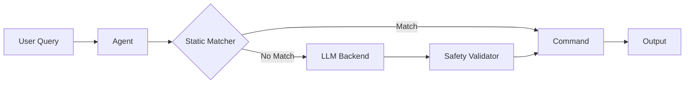

# Documentation Strategy & Standards - v1.1.0

**Audience**: Documentation Team, Contributors, Maintainers
**Last Updated**: January 8, 2026

---

## Table of Contents

1. [Documentation Vision](#documentation-vision)
2. [Documentation Principles](#documentation-principles)
3. [Documentation Types](#documentation-types)
4. [Documentation Standards](#documentation-standards)
5. [Documentation Tools](#documentation-tools)
6. [Documentation Workflow](#documentation-workflow)
7. [Documentation Maintenance](#documentation-maintenance)
8. [Documentation Metrics](#documentation-metrics)
9. [Documentation Roadmap](#documentation-roadmap)
10. [Success Criteria](#success-criteria)

---

## Documentation Vision

### Mission
**"Make Caro easy to learn, easy to use, and easy to contribute to through clear, comprehensive, and accessible documentation."**

### Documentation Goals
1. **Accessibility**: Everyone can understand, regardless of experience level
2. **Completeness**: Every feature documented, no gaps
3. **Accuracy**: Always up-to-date, reflects current version
4. **Discoverability**: Easy to find what you need
5. **Actionable**: Practical examples, copy-paste commands

### Target Audiences
1. **New Users**: Never used CLI tools, intimidated by terminal
2. **Intermediate Users**: Familiar with CLI, learning Caro
3. **Power Users**: CLI experts, want advanced features
4. **Contributors**: Want to contribute code, docs, or community support
5. **Maintainers**: Need architectural understanding, development guides

---

## Documentation Principles

### 1. Show, Don't Just Tell

**Principle**: Examples > Explanations

**Good Documentation**:
```markdown
## Finding Files Modified Today

Use Caro to generate the command:

```bash
$ caro "find files modified today"
find . -type f -mtime -1
```

Run the generated command:
```bash
$ find . -type f -mtime -1
./README.md
./src/main.rs
```

The `-mtime -1` flag finds files modified in the last 24 hours.
```

**Bad Documentation**:
```markdown
## Finding Files

Caro can find files. Use the find command with appropriate flags.
```

---

### 2. Progressive Disclosure

**Principle**: Start simple, add complexity gradually

**Structure**:
1. **Quick Start**: Simplest use case (1-2 minutes)
2. **Common Tasks**: Everyday scenarios (5-10 minutes)
3. **Advanced Features**: Power user features (15+ minutes)
4. **Reference**: Complete API, all options

**Example**:
```
README.md:
  ├─ Quick Start (install + first command)
  ├─ Common Tasks (10 examples)
  └─ See docs/ for advanced features

docs/ADVANCED.md:
  ├─ Configuration (telemetry, safety)
  ├─ Platform Differences (macOS vs Linux)
  └─ See API.md for complete reference

docs/API.md:
  ├─ All Commands (exhaustive)
  ├─ All Flags (every option)
  └─ Exit Codes (for scripts)
```

---

### 3. Assume Nothing, Explain Everything

**Principle**: Don't assume prior knowledge

**Good**:
```markdown
## What is a Shell Command?

A shell command is an instruction you type in the terminal to perform a task.

Example:
```bash
ls -la
```

This command lists all files in the current directory, including hidden files.

- `ls`: The command name (list)
- `-la`: Flags that modify behavior
  - `-l`: Long format (show details)
  - `-a`: Show all (including hidden files starting with `.`)
```

**Bad**:
```markdown
## Commands

Use `ls -la` to list files.
```

---

### 4. One Source of Truth

**Principle**: No duplicate documentation (leads to inconsistency)

**Structure**:
```
README.md (entry point)
  ├─ Links to INSTALL.md (installation)
  ├─ Links to docs/USAGE.md (usage guide)
  └─ Links to CONTRIBUTING.md (contribution guide)

Don't duplicate INSTALL steps in README.
Link instead: "See INSTALL.md for detailed installation instructions."
```

---

### 5. Documentation is Code

**Principle**: Treat docs like code (version control, review, test)

**Practices**:
- Docs live in Git (same repo as code)
- PRs require doc updates (for user-facing changes)
- Code review includes doc review
- Test documentation (links, commands, examples)

---

## Documentation Types

### 1. README (Project Overview)

**Purpose**: First impression, quick understanding

**Location**: `/README.md`

**Contents**:
1. **One-line description**: What is Caro?
2. **Key features**: Top 3-5 features (bullets)
3. **Quick start**: Install + first command (2 minutes)
4. **Examples**: 5-10 common use cases
5. **Links**: Installation, docs, contributing, community

**Length**: 200-400 lines (scannable in <2 minutes)

**Example Structure**:
```markdown
# Caro

Privacy-first, safety-focused CLI tool that converts natural language to shell commands.

## Features
- 🧠 Smart command generation (86.2% accuracy)
- 🛡️ Safety validation (100+ dangerous patterns blocked)
- 🔒 Zero PII in telemetry
- 🌍 Platform-aware (BSD vs GNU)

## Quick Start

[Install + first command]

## Examples

[10 examples]

## Documentation
- [Installation](INSTALL.md)
- [Usage Guide](docs/USAGE.md)
- [Contributing](CONTRIBUTING.md)

## Community
- Discord: [link]
- GitHub Discussions: [link]
```

---

### 2. Installation Guide

**Purpose**: Get Caro running on any system

**Location**: `/INSTALL.md`

**Contents**:
1. **Prerequisites**: System requirements
2. **Installation methods**: Homebrew, script, manual (each platform)
3. **Verification**: How to test it works
4. **Troubleshooting**: Common installation issues
5. **Uninstall**: How to remove Caro

**Example**:
```markdown
# Installation Guide

## macOS

### Option 1: Homebrew (Recommended)
```bash
brew install caro
```

### Option 2: Install Script
```bash
curl -sSL https://install.caro-cli.dev | bash
```

### Verify Installation
```bash
caro --version
# Output: caro 1.1.0-beta
```

### Troubleshooting

**Issue**: "caro: command not found"

**Solution**: Add Homebrew to PATH:
```bash
echo 'export PATH="/opt/homebrew/bin:$PATH"' >> ~/.zshrc
source ~/.zshrc
```

## Linux

[Similar structure for Linux]

## Uninstall

### Homebrew
```bash
brew uninstall caro
```

### Manual
```bash
sudo rm /usr/local/bin/caro
```
```

---

### 3. Usage Guide

**Purpose**: Learn how to use Caro effectively

**Location**: `/docs/USAGE.md`

**Contents**:
1. **Basic usage**: Syntax, options, output
2. **Common tasks**: File management, process monitoring, text processing
3. **Configuration**: Telemetry, safety settings
4. **Advanced features**: Platform detection, safety validation details
5. **Tips & tricks**: Power user features

**Length**: 500-1,000 lines

---

### 4. API Reference

**Purpose**: Complete technical reference

**Location**: `/docs/API.md`

**Contents**:
1. **Commands**: All commands, all flags
2. **Exit codes**: For scripting
3. **Configuration file**: Format, options
4. **Environment variables**: Available vars
5. **Output formats**: JSON, plain text

**Format**: Auto-generated from code (docstrings)

---

### 5. Contributing Guide

**Purpose**: Onboard new contributors

**Location**: `/CONTRIBUTING.md`

**Contents**:
1. **How to contribute**: Code, docs, design, support
2. **Development setup**: Clone, build, test
3. **Coding standards**: Style, patterns, best practices
4. **PR process**: How to submit, review, merge
5. **Community guidelines**: Code of Conduct, communication

**Length**: 300-500 lines

---

### 6. Architecture Documentation

**Purpose**: Understand codebase structure

**Location**: `/docs/ARCHITECTURE.md`

**Audience**: Contributors, maintainers

**Contents**:
1. **High-level design**: Components, data flow
2. **Directory structure**: What's where, why
3. **Key abstractions**: Agent, Backend, Safety Validator
4. **Design decisions**: Why we chose X over Y
5. **Future architecture**: Planned changes

**Diagrams**: Mermaid, ASCII art

---

### 7. Troubleshooting Guide

**Purpose**: Fix common problems

**Location**: `/docs/TROUBLESHOOTING.md`

**Contents**:
1. **Installation issues**: Can't install, command not found
2. **Usage issues**: Command fails, unexpected output
3. **Performance issues**: Slow response, high memory
4. **Platform-specific issues**: macOS quirks, Linux distro differences

**Format**:
```markdown
## Issue: "caro: command not found"

**Symptoms**: Running `caro` returns "command not found"

**Cause**: Caro binary not in PATH

**Solution**:
1. Check if Caro is installed: `ls /usr/local/bin/caro`
2. If installed, add to PATH: [steps]
3. If not installed, see INSTALL.md

**Prevention**: Homebrew installation handles PATH automatically
```

---

### 8. FAQ

**Purpose**: Answer common questions quickly

**Location**: `/docs/FAQ.md`

**Contents**:
1. **General**: What is Caro? Is it free?
2. **Privacy**: What data does Caro collect?
3. **Safety**: How does Caro block dangerous commands?
4. **Platform**: Does it work on Windows?
5. **Comparison**: Caro vs GitHub Copilot CLI

**Format**: Question → Short Answer + Link to Details

---

### 9. Changelog

**Purpose**: Track version history

**Location**: `/CHANGELOG.md`

**Format**: [Keep a Changelog](https://keepachangelog.com/)

**Example**:
```markdown
# Changelog

All notable changes to this project will be documented in this file.

The format is based on [Keep a Changelog](https://keepachangelog.com/en/1.0.0/),
and this project adheres to [Semantic Versioning](https://semver.org/spec/v2.0.0.html).

## [1.1.0-beta] - 2026-01-24

### Added
- Natural language to shell command generation
- Safety validation (100+ patterns)
- Platform awareness (BSD vs GNU)
- Privacy-first telemetry (opt-in, zero PII)

### Fixed
- N/A (initial release)

### Security
- Dangerous command blocking
- Privacy validation ensures zero PII
```

---

## Documentation Standards

### Writing Style

**Tone**:
- Clear and concise (no jargon without explanation)
- Friendly but professional (not overly casual)
- Active voice ("Caro generates commands" not "Commands are generated")
- Second person ("You can use Caro" not "Users can use Caro")

**Formatting**:
- **Headings**: Title Case for ## (H2), Sentence case for ### (H3+)
- **Code blocks**: Always specify language (```bash, ```rust)
- **Lists**: Use `-` for unordered, `1.` for ordered
- **Emphasis**: **Bold** for important, *italic* for emphasis
- **Links**: Descriptive text ([Installation Guide](INSTALL.md), not [click here](INSTALL.md))

---

### Code Examples

**Requirements**:
1. **Runnable**: User can copy-paste and run
2. **Realistic**: Use real-world scenarios
3. **Commented**: Explain non-obvious parts
4. **Output**: Show expected output

**Example**:
```markdown
Find files larger than 10MB:

```bash
$ caro "find files larger than 10MB"
find . -type f -size +10M

$ find . -type f -size +10M
./large-video.mp4
./database-backup.sql
```

The `-size +10M` flag finds files over 10 megabytes.
```

---

### Diagrams

**Tools**:
- **Mermaid**: Flowcharts, sequence diagrams (renders in GitHub)
- **ASCII art**: Simple diagrams, terminal-friendly

**Example (Mermaid)**:
```markdown

```

---

### Links

**Internal Links** (within repo):
- Use relative paths: `[INSTALL.md](INSTALL.md)`
- Not absolute: `[INSTALL.md](https://github.com/org/caro/blob/main/INSTALL.md)`

**External Links** (outside repo):
- Use full URLs: `[Rust](https://www.rust-lang.org/)`
- Check links work (CI test)

---

## Documentation Tools

### Markdown

**Why Markdown**:
- Readable in plain text (no rendering needed)
- Renders beautifully on GitHub
- Widely supported (IDEs, editors, static site generators)
- Simple syntax (easy to learn)

**Standard**: CommonMark (with GitHub Flavored Markdown extensions)

---

### Linting

**Tool**: `markdownlint`

**Purpose**: Enforce style consistency

**Configuration** (`.markdownlint.json`):
```json
{
  "default": true,
  "MD013": false,  // Disable line length rule (code examples can be long)
  "MD033": false   // Allow inline HTML (for tables, diagrams)
}
```

**CI Integration**:
```yaml
# .github/workflows/docs.yml
name: Documentation Lint

on: [push, pull_request]

jobs:
  lint:
    runs-on: ubuntu-latest
    steps:
      - uses: actions/checkout@v3
      - uses: articulate/actions-markdownlint@v1
```

---

### Link Checking

**Tool**: `markdown-link-check`

**Purpose**: Verify all links work (prevent broken links)

**CI Integration**:
```yaml
- name: Check links
  uses: gaurav-nelson/github-action-markdown-link-check@v1
  with:
    use-quiet-mode: 'yes'
    config-file: '.markdown-link-check.json'
```

---

### Documentation Site (Future)

**Tool**: Docusaurus, MkDocs, or mdBook

**Purpose**: Beautiful, searchable documentation site

**When**: v1.2.0 (when docs grow beyond README + a few files)

**Example**: https://docs.caro-cli.dev/
- Searchable
- Versioned (docs for each release)
- Sidebar navigation
- Dark mode

---

## Documentation Workflow

### When to Update Docs

**Always Update Docs For**:
- New features (add to README examples, USAGE.md)
- Breaking changes (update CHANGELOG, migration guide)
- Configuration changes (update USAGE.md, API.md)
- Bug fixes affecting users (update TROUBLESHOOTING.md)

**PR Checklist**:
- [ ] README updated (if user-facing change)
- [ ] USAGE.md updated (if new feature)
- [ ] CHANGELOG.md updated (all changes)
- [ ] Docstrings updated (if API change)

---

### Doc Review Process

**Reviewer Checks**:
1. **Accuracy**: Does it match the code?
2. **Clarity**: Can target audience understand it?
3. **Examples**: Are examples runnable, realistic?
4. **Links**: Do all links work?
5. **Style**: Does it follow standards (tone, formatting)?

**Review Feedback**:
- Use GitHub suggestions (code review comment → "Insert suggestion")
- Be specific ("Add example for X" not "This is unclear")

---

### Doc Testing

**Manual Testing**:
- Copy-paste commands (do they work?)
- Follow installation guide (can new user install?)
- Click all links (do they work?)

**Automated Testing**:
- Link checker (CI)
- Markdown linter (CI)
- Code example extraction + execution (future)

---

## Documentation Maintenance

### Keeping Docs Up-to-Date

**Problem**: Code changes, docs don't → Docs become stale, outdated

**Solutions**:
1. **Doc updates in same PR**: Code + docs together (not separate)
2. **Quarterly doc audit**: Review all docs, update outdated sections
3. **User feedback**: "Was this page helpful?" (identify unclear docs)
4. **Automated checks**: Warn if code changes without doc update

---

### Deprecation Strategy

**When Feature is Deprecated**:
1. **Add deprecation notice**: "⚠️ DEPRECATED: Use X instead"
2. **Update CHANGELOG**: List deprecated features
3. **Migration guide**: How to move from old to new
4. **Remove in next major version**: v1.X → v2.0

**Example**:
```markdown
## `caro generate` (DEPRECATED)

⚠️ **DEPRECATED**: Use `caro "query"` instead.

This command is deprecated and will be removed in v2.0.0.

**Migration**:
```bash
# Old (deprecated)
caro generate "list files"

# New (recommended)
caro "list files"
```

See [Migration Guide](MIGRATION.md) for details.
```

---

### Versioned Docs (Future)

**Problem**: Users on v1.0.0 see docs for v1.2.0 → Confusion

**Solution**: Versioned documentation site
- docs.caro-cli.dev/v1.0.0/
- docs.caro-cli.dev/v1.1.0/
- docs.caro-cli.dev/latest/ (current version)

**Implementation**: Docusaurus or MkDocs (supports versioning)

---

## Documentation Metrics

### Success Metrics

**User-Facing Metrics**:
- Documentation page views (top 10 most-read pages)
- Search queries (what are users searching for?)
- "Was this helpful?" feedback (% yes/no)
- Support questions (are docs reducing questions?)

**Internal Metrics**:
- Doc coverage (% of features documented)
- Doc freshness (time since last update)
- Broken links (0 broken links target)
- PR doc update rate (% of PRs that update docs)

---

### Quarterly Doc Audit

**Process** (every 3 months):
1. **Review all docs**: Check accuracy, clarity, completeness
2. **Update outdated sections**: Code changed, docs didn't
3. **Add missing docs**: New features without docs
4. **Remove obsolete docs**: Deprecated features
5. **Improve clarity**: Sections users found confusing

**Audit Checklist**:
- [ ] README reflects current features
- [ ] INSTALL.md works for all platforms
- [ ] USAGE.md covers all major features
- [ ] TROUBLESHOOTING.md has top 10 issues
- [ ] FAQ.md has top 20 questions
- [ ] CHANGELOG.md is up-to-date
- [ ] All links work (no 404s)

---

## Documentation Roadmap

### v1.1.0 (Current - Jan 2026)

**Status**: ✅ Baseline documentation complete

- [x] README.md (project overview)
- [x] INSTALL.md (installation guide)
- [x] CONTRIBUTING.md (contribution guide)
- [x] CHANGELOG.md (version history)
- [x] LICENSE (MIT license)

---

### v1.2.0 (Mar 2026)

**Focus**: Expand user guides, add troubleshooting

- [ ] docs/USAGE.md (comprehensive usage guide)
- [ ] docs/TROUBLESHOOTING.md (common issues + solutions)
- [ ] docs/FAQ.md (top 20 questions)
- [ ] Video tutorial (5-minute "Getting Started")

---

### v1.3.0 (Jun 2026)

**Focus**: Advanced guides, architecture docs

- [ ] docs/ADVANCED.md (power user features)
- [ ] docs/ARCHITECTURE.md (codebase structure)
- [ ] docs/PLATFORM_DIFFERENCES.md (BSD vs GNU deep-dive)
- [ ] API reference (auto-generated from docstrings)

---

### v1.4.0 (Sep 2026)

**Focus**: Documentation site, versioning

- [ ] Launch docs.caro-cli.dev (Docusaurus site)
- [ ] Versioned docs (per-release documentation)
- [ ] Searchable docs (full-text search)
- [ ] Interactive examples (CodeSandbox, Repl.it)

---

## Success Criteria

### Documentation Quality

**Standards Met**:
- All features documented (100% coverage)
- All examples runnable (copy-paste works)
- All links valid (0 broken links)
- Passes linter (markdownlint, no warnings)

**User Satisfaction**:
- "Was this helpful?" >80% yes
- Support questions reduced by 50% (docs answer questions)
- Installation success rate >95% (INSTALL.md works)

---

### Documentation Contribution

**Community Engagement**:
- 10+ doc PRs from community (v1.1.0 → v1.2.0)
- Doc contributors recognized (in CONTRIBUTORS.md)

---

## Summary

### Documentation Vision
Make Caro easy to learn, easy to use, and easy to contribute to through clear, comprehensive, and accessible documentation.

### Documentation Principles
- Show don't just tell (examples > explanations)
- Progressive disclosure (simple → complex)
- Assume nothing (explain everything)
- One source of truth (no duplicates)
- Documentation is code (version control, review, test)

### Documentation Types (9 Essential)
1. README (project overview, quick start)
2. INSTALL.md (installation all platforms)
3. USAGE.md (comprehensive usage guide)
4. API.md (complete technical reference)
5. CONTRIBUTING.md (contributor onboarding)
6. ARCHITECTURE.md (codebase structure)
7. TROUBLESHOOTING.md (common problems)
8. FAQ.md (frequent questions)
9. CHANGELOG.md (version history)

### Documentation Standards
- Writing style (clear, friendly, active voice, second person)
- Code examples (runnable, realistic, commented, output shown)
- Diagrams (Mermaid flowcharts, ASCII art)
- Links (relative internal, full external, check validity)

### Documentation Tools
- Markdown (CommonMark + GitHub Flavored)
- Linting (markdownlint CI enforcement)
- Link checking (markdown-link-check automated)
- Documentation site future (Docusaurus/MkDocs v1.4.0)

### Documentation Workflow
- Update with code changes (same PR)
- Doc review process (accuracy, clarity, examples, links, style)
- Doc testing (manual copy-paste, automated CI)

### Documentation Maintenance
- Quarterly audit (review all docs every 3 months)
- Deprecation strategy (notice, CHANGELOG, migration guide, remove v2.0)
- Versioned docs future (docs.caro-cli.dev/v1.X.X/)

### Success Metrics
- Quality (100% coverage, runnable examples, 0 broken links, passes linter)
- User satisfaction (>80% helpful, 50% fewer support questions, >95% install success)
- Community (10+ doc PRs, contributors recognized)

---

**Document Version**: 1.0
**Last Updated**: January 8, 2026
**Owner**: Documentation Team, Maintainers
