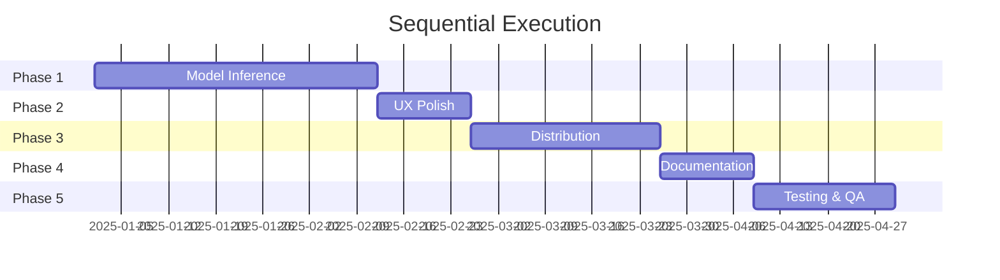
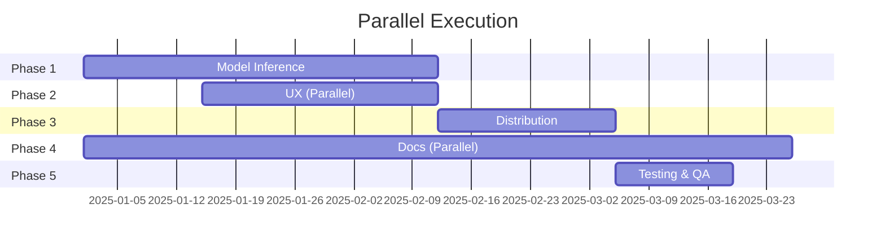

# cmdai Multi-Agent Execution System

## Overview

This document explains how to use the specialized sub-agent system to execute the cmdai MVP roadmap efficiently with parallel execution and context optimization.

**The Problem**: The MVP roadmap is comprehensive but overwhelming for a single coordinator to manage. Breaking work across specialized agents enables:
- ✅ **Parallel execution** - Multiple phases can progress simultaneously
- ✅ **Context efficiency** - Each agent focuses on their domain expertise
- ✅ **Better delegation** - Clear ownership and accountability
- ✅ **Scalability** - Easy to onboard new contributors to specific areas

## Agent Architecture

```
┌─────────────────────────────────────────────────────────┐
│           Main Coordinator (You/Lead Dev)                │
│                                                          │
│  - Strategic oversight                                   │
│  - Agent coordination                                    │
│  - Final decision making                                 │
│  - Escalation handling                                   │
└─────────────────────────────────────────────────────────┘
                            │
        ┌───────────────────┼───────────────────┐
        │                   │                   │
┌───────▼────────┐ ┌────────▼───────┐ ┌────────▼────────┐
│  Phase Agents  │ │ Cross-Cutting  │ │   Community     │
│                │ │    Agents      │ │    Agents       │
│ • Phase 1      │ │ • Technical PM │ │ • Community Mgr │
│ • Phase 2      │ │ • Code Review  │ │                 │
│ • Phase 3      │ │                │ │                 │
│ • Phase 4      │ │                │ │                 │
│ • Phase 5      │ │                │ │                 │
└────────────────┘ └────────────────┘ └─────────────────┘
```

## Available Agents

### Phase Agents (Sequential, with parallel work opportunities)

| Agent | File | Focus | Timeline | Can Start |
|-------|------|-------|----------|-----------|
| **Phase 1** | `.agent-prompts/phase-1-inference.md` | Real model inference | Weeks 1-6 | ✅ Now |
| **Phase 2** | `.agent-prompts/phase-2-ux.md` | UX & Branding | Weeks 5-7 | Week 3 (partial) |
| **Phase 3** | `.agent-prompts/phase-3-distribution.md` | Distribution & Packaging | Weeks 8-12 | Week 7 |
| **Phase 4** | `.agent-prompts/phase-4-documentation.md` | Documentation | Weeks 11-13 | Week 1 (structure) |
| **Phase 5** | `.agent-prompts/phase-5-testing.md` | Testing & QA | Weeks 14-16 | Week 13 |

### Cross-Cutting Agents (Active throughout)

| Agent | File | Focus | When Active |
|-------|------|-------|-------------|
| **Technical PM** | `.agent-prompts/technical-pm.md` | Task coordination, progress tracking | ✅ Always |
| **Code Reviewer** | `.agent-prompts/code-reviewer.md` | Quality assurance, PR review | ✅ On-demand |
| **Community Mgr** | `.agent-prompts/community-manager.md` | Community building, voting | ✅ Always |

## How to Launch Agents

### Option 1: Using Claude Code Task Tool

```python
# Example: Launch Phase 1 Agent
Use Task tool with:
  subagent_type: "rust-cli-expert"  # or "general-purpose"
  description: "Implement real model inference"
  prompt: """
  [Paste entire content of .agent-prompts/phase-1-inference.md]

  Your current task: Implement llama-cpp-rs backend integration.
  See PHASE_1_TASKS.md for detailed breakdown.

  Start with Milestone 1.1 (Setup & Proof of Concept).
  """
```

### Option 2: Using Spec-Driven Commands

For each feature/phase:
```bash
# 1. Create spec
/specify Feature 006: Real Model Inference Integration

# 2. Create plan
/plan specs/006-real-mlx-inference.md

# 3. Generate tasks
/tasks specs/006-real-mlx-inference.md

# 4. Launch agent to implement
[Use Task tool with phase agent prompt + tasks.md]
```

### Option 3: Direct Prompting

For simple sub-tasks, directly prompt with agent context:
```
You are the Phase 1 Agent (Model Inference Engineer).
See .agent-prompts/phase-1-inference.md for your full context.

Current task: Implement Task 2.3 (Lazy model loading)
Files: src/backends/embedded/llama_cpp.rs
Reference: PHASE_1_TASKS.md lines 180-200

[Rest of specific instructions]
```

## Execution Strategies

### Strategy A: Sequential (Safe, Solo Developer)

Best for: Solo developers, limited time, learning as you go

**Timeline**: 12-16 weeks



**Execution**:
1. Launch Phase 1 agent → Complete fully
2. Launch Phase 2 agent → Complete fully
3. Launch Phase 3 agent → Complete fully
4. Launch Phase 4 agent → Complete fully
5. Launch Phase 5 agent → Complete fully
6. MVP Release 🎉

### Strategy B: Parallel (Fast, Small Team)

Best for: 2-3 person teams, experienced developers

**Timeline**: 8-12 weeks



**Execution**:
1. **Week 1-2**: Phase 1 only (critical path)
2. **Week 3-6**: Phase 1 + Phase 2 parallel (UX design)
3. **Week 7-9**: Phase 3 (distribution)
4. **Week 1-12**: Phase 4 ongoing (documentation)
5. **Week 10-12**: Phase 5 (testing)
6. MVP Release 🎉

**Parallel Work Opportunities**:
- Weeks 3-6: Phase 1 (implementation) + Phase 2 (design)
- Weeks 1-12: Phase 4 (docs) can run throughout
- Weeks 7-9: Phase 3 (distribution) + Phase 4 (docs finalization)

### Strategy C: Fully Distributed (Aggressive, Community)

Best for: Active community with 5+ contributors

**Timeline**: 6-10 weeks

**Execution**:
1. **Technical PM** coordinates all agents
2. **Phase 1 Agent** (2 devs): Inference implementation
3. **Phase 2 Agent** (1 dev): UX parallel work
4. **Phase 3 Agent** (1 dev): Distribution research/setup
5. **Phase 4 Agent** (1 dev): Documentation throughout
6. **Code Reviewer**: Reviews all PRs
7. **Community Manager**: Facilitates collaboration

## Agent Coordination Protocol

### 1. Daily Standup (Async, GitHub Discussions)

Each agent posts:
```markdown
### Agent: [Phase X / Cross-Cutting]
**Completed**: [Yesterday's accomplishments]
**In Progress**: [Today's work]
**Blocked**: [Any blockers]
**Needs**: [Support/decisions needed]
```

**Template**: Use `.agent-prompts/README.md` status board template

### 2. Weekly Sync (GitHub Discussion Thread)

**Technical PM** posts:
- Progress summary
- Milestone status
- Upcoming handoffs
- Risk updates
- Next week plan

**All agents** comment with updates

### 3. Phase Handoffs (GitHub Discussion + Milestone)

Before completing a phase:
1. **Outgoing agent** creates handoff document
2. **Incoming agent** reviews and asks questions
3. **Technical PM** facilitates meeting
4. **Code Reviewer** validates deliverables
5. **Main Coordinator** approves handoff

**Handoff Checklist**: See `.agent-prompts/technical-pm.md`

### 4. Escalations (GitHub Issues)

When agent hits blocker:
1. Create issue with label `blocker`
2. Tag relevant agents and `@main-coordinator`
3. Propose 2-3 solutions
4. Request decision
5. Implement approved solution

## Communication Channels

### GitHub Discussions (Primary)

**Categories**:
- **Agent Coordination**: Daily standups, handoffs
- **Technical Decisions**: Architecture, approach
- **Blockers & Escalations**: Issues needing resolution
- **Progress Updates**: Weekly summaries

### GitHub Issues (Tracking)

**Labels**:
- `phase-1` through `phase-5`
- `blocker` - Blocking progress
- `help-wanted` - Need assistance
- `agent:inference`, `agent:ux`, etc.

### GitHub Projects (Visibility)

**Board**: "MVP Development"
- **Columns**: Backlog | To Do | In Progress | Blocked | Review | Done
- **Swim Lanes**: By Phase
- **Assignees**: Agent type (e.g., `@phase-1-agent`)

## Example: Launching Phase 1

### Step 1: Prepare Context

```bash
# Read the agent's master prompt
cat .agent-prompts/phase-1-inference.md

# Read the detailed tasks
cat PHASE_1_TASKS.md

# Understand current codebase
ls -la src/backends/embedded/
```

### Step 2: Launch Agent

Use Claude Code Task tool:

```markdown
**Agent Type**: rust-cli-expert (or general-purpose)
**Description**: Implement Phase 1 - Real Model Inference

**Prompt**:
You are the Phase 1 Agent (Model Inference Engineer) for cmdai.

MASTER PROMPT:
[Paste content of .agent-prompts/phase-1-inference.md]

CURRENT STATE:
- Repository: /home/user/cmdai
- Branch: claude/phase-1-inference
- Current Phase: Phase 1 - Real Model Inference
- Timeline: Weeks 1-6 (4-6 weeks realistic)

YOUR MISSION:
Implement real LLM inference using llama-cpp-rs (recommended) or candle.

TASK BREAKDOWN:
See PHASE_1_TASKS.md for 40+ detailed tasks.

START WITH:
Milestone 1: Setup & Proof of Concept
- Task 1.1: Research llama-cpp-rs
- Task 1.2: Add dependency
- Task 1.3: Create basic inference example

DELIVERABLES:
By end of your phase, deliver working inference integrated with CLI.

COORDINATION:
- Report progress daily in GitHub Discussions
- Escalate blockers immediately
- Coordinate with Phase 2 agent (UX) starting Week 3

BEGIN: Start with Task 1.1 (Research llama-cpp-rs)
```

### Step 3: Monitor Progress

1. **Daily**: Check GitHub Discussions for standup
2. **Weekly**: Review progress report
3. **On Blockers**: Help resolve via Discussion/Issue
4. **Milestones**: Approve handoffs between milestones

### Step 4: Code Review

When agent creates PRs:
1. Launch Code Reviewer agent
2. Provide PR link and context
3. Reviewer provides feedback
4. Agent addresses feedback
5. Merge when approved

## Success Metrics

### For Each Agent

**Velocity**:
- Tasks completed per week
- Ahead/behind schedule
- Blockers resolved

**Quality**:
- Code review pass rate
- Tests passing
- Documentation complete

**Communication**:
- Daily updates provided
- Escalations timely
- Handoffs smooth

### For Overall System

**Coordination**:
- Phases handoff smoothly
- Minimal cross-agent conflicts
- Information flows well

**Timeline**:
- MVP ships on time (or early)
- No major delays
- Risks mitigated

**Quality**:
- All tests passing
- Performance targets met
- Documentation complete
- Community satisfied

## Troubleshooting

### Agent Not Progressing

**Symptoms**: No updates, stuck on task
**Solutions**:
1. Check for blockers in Discussion
2. Review task clarity
3. Provide additional context
4. Reassign task if needed
5. Break task into smaller pieces

### Agents Working on Conflicting Changes

**Symptoms**: Merge conflicts, duplicate work
**Solutions**:
1. Technical PM coordinates
2. Define clear boundaries
3. More frequent syncs
4. Use feature branches
5. Lock files when editing

### Quality Issues

**Symptoms**: Tests failing, bugs introduced
**Solutions**:
1. Code Reviewer more involved
2. Require reviews before merge
3. Add more automated checks
4. Pair programming on complex tasks
5. Technical debt sprint

### Timeline Slipping

**Symptoms**: Behind schedule, milestones missed
**Solutions**:
1. Scope reduction (defer nice-to-haves)
2. Additional resources
3. Parallel execution where possible
4. Focus on critical path
5. Adjust expectations

## FAQs

### Q: Can I use just some agents, not all?

**A**: Yes! Start with Phase 1 agent. Add others as needed.

### Q: What if I'm a solo developer?

**A**: Use agents sequentially. They're still helpful for focused expertise and context.

### Q: How do agents "remember" context?

**A**: Each invocation includes the master prompt + current state. Agents are stateless but context-aware.

### Q: Can I customize agent prompts?

**A**: Yes! Edit `.agent-prompts/*.md` files to fit your needs.

### Q: What if an agent makes a mistake?

**A**: Main Coordinator reviews and corrects. Use Code Reviewer agent for quality control.

### Q: How do I know which agent to launch?

**A**: Use the decision tree in `.agent-prompts/README.md`

## Next Steps

1. **Read this doc** to understand the system
2. **Read `.agent-prompts/README.md`** for agent details
3. **Choose your strategy** (Sequential, Parallel, Distributed)
4. **Launch Technical PM** to set up tracking
5. **Launch Phase 1 Agent** to start implementation
6. **Monitor and coordinate** using GitHub tools
7. **Ship MVP** 🚀

---

**Remember**: The agents are tools to help you execute efficiently. You remain the strategic decision-maker and final authority.

**Let's build cmdai together!** 💙
