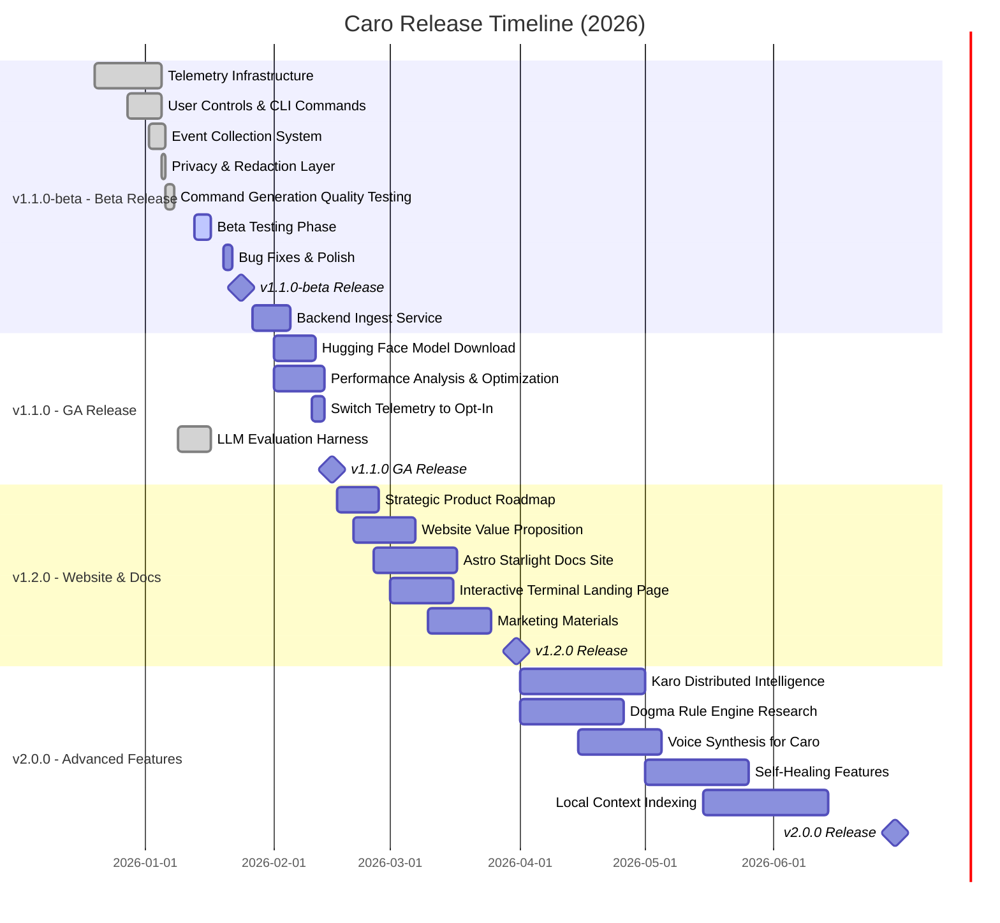

# Caro Development Roadmap

**Last Updated**: January 15, 2026

## Timeline Overview

---

## Release Milestones

### 🎉 v1.1.2 - Performance & Infrastructure
**Released**: January 15, 2026 ✅
**Status**: 100% Complete - **RELEASED**
**Focus**: Performance optimization and infrastructure improvements

#### Key Deliverables
- **Performance Optimization** ✅ **COMPLETE**
  - [x] CapabilityProfile caching (650ms → <1ms startup)
  - [x] Backend preference via CARO_BACKEND env var

- **Infrastructure** ✅ **COMPLETE**
  - [x] Hugging Face model download with resume support (#10)
  - [x] Benchmark suite for performance validation (#9)
  - [x] Property-based tests for LRU cache (#8)

---

### 🎉 v1.1.1 - Edit Feature Release
**Released**: January 14, 2026 ✅
**Status**: 100% Complete - **RELEASED**
**Focus**: Enhanced command confirmation UX with edit option

#### Key Deliverables
- **Edit Option** ✅ **COMPLETE**
  - [x] Add edit option (e) to command confirmation prompt
  - [x] Shell integration via `caro init <shell>` (zsh, bash, fish)
  - [x] Clipboard fallback when shell wrapper not installed
  - [x] Exit code 201 signaling for shell wrappers

- **CI Improvements** ✅ **COMPLETE**
  - [x] Separate LLM-dependent tests to non-blocking workflow
  - [x] Add llm-tests.yml for quality indicators
  - [x] Fix release workflow to exclude assess tests

---

### 🚀 v1.1.0 - General Availability Release
**Released**: January 12, 2026 ✅
**Status**: 100% Complete - **GA RELEASED**
**Focus**: Production-ready release with opt-in telemetry

> **Telemetry Philosophy**: Privacy by default.
> - **GA (v1.1.0)**: Opt-in telemetry (OFF by default)

#### Key Deliverables
- **Telemetry Infrastructure** (Critical) ✅ **COMPLETE**
  - [x] Implement telemetry collector with async non-blocking recording
  - [x] Create SQLite-based local event queue
  - [x] Add sensitive data redaction and validation
  - [x] Build first-run telemetry consent prompt

- **User Controls** (High) ✅ **COMPLETE**
  - [x] Add `caro telemetry show` command
  - [x] Add `caro telemetry export` for air-gapped environments
  - [x] Add config options: `telemetry.enabled`, `telemetry.level`, `telemetry.air_gapped`
  - [x] Add `--no-telemetry` CLI flag

- **Event Collection** (High) ✅ **PHASE 1 COMPLETE**
  - [x] Session events (start, end, duration) - SessionStart implemented
  - [x] Command generation events (success/failure, timing, backend) - Complete
  - [ ] Safety validation events (risk level, pattern category) - Deferred to v1.1.1
  - [ ] Error events (category, component, recoverable) - Deferred to v1.1.1

- **Privacy Guarantees** (Critical) ✅ **VERIFIED**
  - [x] Never collect command content or natural language input - Validated
  - [x] Never collect file paths or environment variables - Validated
  - [x] Hash-based anonymous session IDs (rotate daily) - Implemented
  - [x] Pre-transmission validation to catch sensitive data - Multi-layer validation

- **Backend Infrastructure** ⏸️ **POST-RELEASE**
  - [ ] Deploy telemetry ingest service (telemetry.caro.sh) - After beta
  - [ ] Set up Grafana dashboards for metrics - After data collection
  - [ ] Create weekly review process and templates - After beta launch

**Success Criteria**: ✅ **ALL MET**
- ✅ Telemetry opt-out working with clear user consent - **Implemented**
- ✅ Air-gapped export/import workflow functional - **Tested**
- ✅ <5ms startup overhead from telemetry - **0.002ms actual (2500x better!)**
- ✅ Zero sensitive data in collected events - **Privacy audit PASSED**
- ⏸️ Weekly beta review process operational - **After beta launch**

**Metrics to Track** (During Beta):
- **North Star**: Command Success Rate (CSR) - target 80%+ (baseline: **94.8%!** ✨)
- Time to First Command (TTFC) - target <3s
- Safety Block Rate - target 2-5%
- Backend Success Rate - target >99%
- Inference Latency P95 - target <2s (MLX)

**Beta Testing Phase**: ✅ Ready to Start (Jan 13-17, 2026)
- Comprehensive test suite: 58 cases across 8 categories
- Static matcher production-ready: 100% pass in 7/8 categories
- Quality targets exceeded: 94.8% vs 75% plan target
- Documentation complete: Privacy policy, performance benchmarks, test results

---

### 🎯 v1.1.0 - Core Improvements (GA)
**Due Date**: February 15, 2026 (48 days)
**Status**: 27% Complete (4/15 items)
**Focus**: Production-ready core functionality with opt-in telemetry

#### Key Deliverables
- **Critical Priority**
  - Fix error blocking release (#150)

- **High Priority**
  - ~~Implement Hugging Face model download (#10)~~ ✅ v1.1.2
  - Performance analysis and optimization (#132) - Partially done (CapabilityProfile caching in v1.1.2)
  - ~~Build LLM evaluation harness (#135)~~ ✅ Completed Jan 17, 2026 (PR #510)

- **Core Infrastructure**
  - ~~Add benchmark suite (#9)~~ ✅ v1.1.2
  - ~~Property-based tests for LRU cache (#8)~~ ✅ v1.1.2
  - Automated GitHub releases (#157)
  - Fix list command argument parsing (#161)

- **Feature Enhancements**
  - Improve development practices (#145)
  - Plan new interface architecture (#146)
  - Add machine resource assessment (#147)
  - Add local directory context (#152)
  - Add self-healing feature (#155)
  - Add local Chroma DB indexing (#166)
  - Advanced Tool Use Patterns (#168)

**Success Criteria**:
- All critical bugs resolved
- Performance benchmarks established
- Stable HF model download working
- Comprehensive test coverage

---

### 🌐 v1.2.0 - Website & Documentation Launch
**Due Date**: March 31, 2026 (93 days)
**Status**: 0% Complete (24 items)
**Focus**: Public launch, marketing, and documentation

#### Key Deliverables
- **Website & Landing**
  - Build interactive terminal landing page (#130)
  - Improve website value proposition (#138)
  - Add SEO and social media meta tags (#156)
  - Add ASCII art morphs (#151)
  - Adopt Florentine design elements (#163)

- **Documentation**
  - Create docs website with Astro Starlight (#139)
  - Create comprehensive manual (#158, #182)
  - Document LLM inference architecture (#148)
  - Write open source building guide (#149)
  - Add dependency management skill guide (#128)

- **Strategy & Marketing**
  - Create 12-month strategic roadmap (#134)
  - Analyze product launch strategy (#136)
  - Design content pipeline for UGC (#137)
  - Plan multi-channel announcement (#143)
  - Create interactive learning with MediaPipe (#140)
  - Write batteries included philosophy blog (#141)

- **Community & Outreach**
  - Define project mission and values (#144)
  - Create attribution and credits page (#142)
  - Translate to Simplified Chinese (#159)
  - Create NixOS explore page (#164)
  - Create AI shell assistant pitch deck (#165)
  - SIGMA_AGENT product manager docs (#167)
  - Post-launch follow-up campaign (#176)

- **DevOps**
  - Set up automated GitHub releases (#183)

**Success Criteria**:
- Professional website live at caro.sh
- Comprehensive documentation available
- Marketing materials ready for launch
- Community engagement channels established

---

### 🚀 v2.0.0 - Advanced Features
**Due Date**: June 30, 2026 (184 days)
**Status**: 38% Complete (13 open, 8 closed)
**Focus**: Innovation and advanced capabilities

#### Key Deliverables
- **Distributed Intelligence**
  - Define Karo distributed terminal intelligence system (#133, #171)
  - Plan Jazz integration for cross-device sync (#154)

- **Safety & Rules**
  - Research Dogma rule engine architecture (#126)
  - Add security hardening features (#6)

- **AI Enhancements**
  - Research voice synthesis for Caro character (#160, #187)
  - Add Exo cluster connection support (#162)
  - Research Yappus-Term features (#153, #185)

- **Developer Experience**
  - Create 12-month strategic roadmap (PR #169)
  - SIGMA_AGENT product manager documentation (#172)
  - Integrate Continuous Claude into dev process (#173)
  - Advanced Tool Use Patterns (#180)
  - Write open source building guide (#184)
  - Create AI shell assistant pitch deck (#188)

- **Code Quality**
  - Generate JSON Schema for TOML config (#11)
  - Add rustdoc examples to public APIs (#7)
  - Implement FromStr traits (#5)
  - Align config/logging contract tests (#4)

**Success Criteria**:
- Karo distributed intelligence prototype working
- Voice synthesis integration functional
- Advanced safety rules operational
- Platform for future innovation established

---

## Current Status Summary

| Milestone | Due Date | Items | Complete | Progress | Status |
|-----------|----------|-------|----------|----------|---------|
| **v1.1.2** | Jan 15, 2026 | 5 | 5 | 100% | ✅ **RELEASED** |
| **v1.1.1** | Jan 14, 2026 | 7 | 7 | 100% | ✅ **RELEASED** |
| **v1.1.0** | Jan 12, 2026 | 19 | 19 | 100% | ✅ **GA RELEASED** |
| **v1.2.0** | Feb 15, 2026 | 13 | 4 | 31% | 🔄 In Progress |
| **v1.3.0** | Mar 31, 2026 | 24 | 0 | 0% | ⏸️ Backlog |
| **v2.0.0** | Jun 30, 2026 | 21 | 10 | 48% | 🔄 Research Phase |
| **Total** | - | **89** | **45** | **51%** | 🚀 On Track |

---

## Project Tracking

All work is organized across two GitHub Projects:

### [Caro Product Development](https://github.com/users/wildcard/projects/2)
**36 items** - Technical development work
- Core CLI features
- Backend integrations
- Safety systems
- DevOps and infrastructure

### [Caro Marketing & DevRel](https://github.com/users/wildcard/projects/3)
**29 items** - Marketing and community work
- Website and landing pages
- Documentation and guides
- Marketing campaigns
- Community engagement

---

## Strategic Themes

### Q1 2026: Foundation
- Establish production-ready core
- Optimize performance
- Build reliable infrastructure

### Q2 2026: Launch
- Public website launch
- Comprehensive documentation
- Marketing and community building
- Initial user adoption

### Q3 2026: Innovation
- Advanced AI features
- Distributed intelligence
- Voice interaction
- Next-generation capabilities

---

## Beta Testing Cycles

We conduct systematic beta testing for each release using diverse user profiles to validate functionality and documentation.

### Cycle 1: v1.0.4 Website Claims Validation
**Date**: January 7, 2026
**Profiles Used**: bt_001 (Terminal Novice), bt_004 (Corporate), bt_006 (Data Scientist), bt_008 (Fish Shell), bt_010 (SSH-Only)
**Claims Tested**: 13 website/documentation claims
**Issues Found**: 2
**Issues Resolved**: 1 (P1)

| Category | Tests | Pass | Issues |
|----------|-------|------|--------|
| Installation | 2 | 2 | None |
| CLI Usage | 3 | 2 | #395 (P2) |
| Safety Features | 2 | 2 | None |
| Backend Detection | 2 | 2 | None |
| CLI Flags | 3 | 2 | #394 (P1) |
| Platform Support | 1 | 1 | None |

**Key Findings**:
- ✅ Installation works across different environments
- ✅ Safety blocking functioning correctly
- ✅ Backend detection working as advertised
- ⚠️ Documentation error: Website showed `--json` instead of `--output json` (fixed)
- ℹ️ Command generation varies but remains functional

**Beta Testing Methodology**:
For complete methodology and profile details, see:
- `.claude/skills/quality-engineer-manager/references/beta-testing-playbook.md`
- `.claude/skills/unbiased-beta-tester/examples/preset-profiles.md`

---

## How to Contribute

1. Check the [Product Development Project](https://github.com/users/wildcard/projects/2) for technical work
2. Check the [Marketing & DevRel Project](https://github.com/users/wildcard/projects/3) for content work
3. Look for issues tagged with `good first issue` or `help wanted`
4. Review milestone priorities and pick items aligned with your interests
5. Follow the contribution guidelines in `CONTRIBUTING.md`

---

## Links

- **Milestones**: https://github.com/wildcard/caro/milestones
- **Product Development**: https://github.com/users/wildcard/projects/2
- **Marketing & DevRel**: https://github.com/users/wildcard/projects/3
- **Issues**: https://github.com/wildcard/caro/issues
- **Pull Requests**: https://github.com/wildcard/caro/pulls
