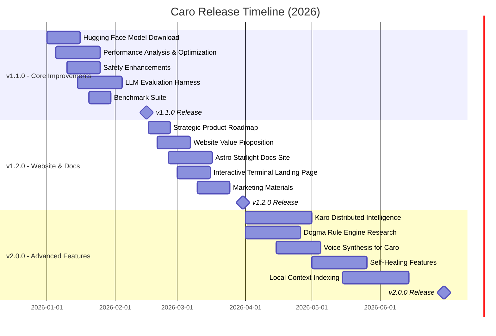

# Caro Development Roadmap

**Last Updated**: December 28, 2024

## Timeline Overview

---

## Release Milestones

### 🎯 v1.1.0 - Core Improvements
**Due Date**: February 15, 2026 (48 days)
**Status**: 7% Complete (1/15 items)
**Focus**: Production-ready core functionality

#### Key Deliverables
- **Critical Priority**
  - Fix error blocking release (#150)

- **High Priority**
  - Implement Hugging Face model download (#10)
  - Performance analysis and optimization (#132)
  - Build LLM evaluation harness (#135)

- **Core Infrastructure**
  - Add benchmark suite (#9)
  - Property-based tests for LRU cache (#8)
  - Automated GitHub releases (#157)
  - Fix list command argument parsing (#161)

- **Feature Enhancements**
  - Improve development practices (#145)
  - Plan new interface architecture (#146)
  - Add machine resource assessment (#147)
  - Add local directory context (#152)
  - Add self-healing feature (#155)
  - Add local Chroma DB indexing (#166)
  - Advanced Tool Use Patterns (#168)

**Success Criteria**:
- All critical bugs resolved
- Performance benchmarks established
- Stable HF model download working
- Comprehensive test coverage

---

### 🌐 v1.2.0 - Website & Documentation Launch
**Due Date**: March 31, 2026 (93 days)
**Status**: 0% Complete (24 items)
**Focus**: Public launch, marketing, and documentation

#### Key Deliverables
- **Website & Landing**
  - Build interactive terminal landing page (#130)
  - Improve website value proposition (#138)
  - Add SEO and social media meta tags (#156)
  - Add ASCII art morphs (#151)
  - Adopt Florentine design elements (#163)

- **Documentation**
  - Create docs website with Astro Starlight (#139)
  - Create comprehensive manual (#158, #182)
  - Document LLM inference architecture (#148)
  - Write open source building guide (#149)
  - Add dependency management skill guide (#128)

- **Strategy & Marketing**
  - Create 12-month strategic roadmap (#134)
  - Analyze product launch strategy (#136)
  - Design content pipeline for UGC (#137)
  - Plan multi-channel announcement (#143)
  - Create interactive learning with MediaPipe (#140)
  - Write batteries included philosophy blog (#141)

- **Community & Outreach**
  - Define project mission and values (#144)
  - Create attribution and credits page (#142)
  - Translate to Simplified Chinese (#159)
  - Create NixOS explore page (#164)
  - Create AI shell assistant pitch deck (#165)
  - SIGMA_AGENT product manager docs (#167)
  - Post-launch follow-up campaign (#176)

- **DevOps**
  - Set up automated GitHub releases (#183)

**Success Criteria**:
- Professional website live at caro.sh
- Comprehensive documentation available
- Marketing materials ready for launch
- Community engagement channels established

---

### 🚀 v2.0.0 - Advanced Features
**Due Date**: June 30, 2026 (184 days)
**Status**: 38% Complete (13 open, 8 closed)
**Focus**: Innovation and advanced capabilities

#### Key Deliverables
- **Distributed Intelligence**
  - Define Karo distributed terminal intelligence system (#133, #171)
  - Plan Jazz integration for cross-device sync (#154)

- **Safety & Rules**
  - Research Dogma rule engine architecture (#126)
  - Add security hardening features (#6)

- **AI Enhancements**
  - Research voice synthesis for Caro character (#160, #187)
  - Add Exo cluster connection support (#162)
  - Research Yappus-Term features (#153, #185)

- **Developer Experience**
  - Create 12-month strategic roadmap (PR #169)
  - SIGMA_AGENT product manager documentation (#172)
  - Integrate Continuous Claude into dev process (#173)
  - Advanced Tool Use Patterns (#180)
  - Write open source building guide (#184)
  - Create AI shell assistant pitch deck (#188)

- **Code Quality**
  - Generate JSON Schema for TOML config (#11)
  - Add rustdoc examples to public APIs (#7)
  - Implement FromStr traits (#5)
  - Align config/logging contract tests (#4)

**Success Criteria**:
- Karo distributed intelligence prototype working
- Voice synthesis integration functional
- Advanced safety rules operational
- Platform for future innovation established

---

## Current Status Summary

| Milestone | Due Date | Items | Complete | Progress |
|-----------|----------|-------|----------|----------|
| **v1.1.0** | Feb 15, 2026 | 15 | 1 | 7% |
| **v1.2.0** | Mar 31, 2026 | 24 | 0 | 0% |
| **v2.0.0** | Jun 30, 2026 | 21 | 8 | 38% |
| **Total** | - | **60** | **9** | **15%** |

---

## Project Tracking

All work is organized across two GitHub Projects:

### [Caro Product Development](https://github.com/users/wildcard/projects/2)
**36 items** - Technical development work
- Core CLI features
- Backend integrations
- Safety systems
- DevOps and infrastructure

### [Caro Marketing & DevRel](https://github.com/users/wildcard/projects/3)
**29 items** - Marketing and community work
- Website and landing pages
- Documentation and guides
- Marketing campaigns
- Community engagement

---

## Strategic Themes

### Q1 2026: Foundation
- Establish production-ready core
- Optimize performance
- Build reliable infrastructure

### Q2 2026: Launch
- Public website launch
- Comprehensive documentation
- Marketing and community building
- Initial user adoption

### Q3 2026: Innovation
- Advanced AI features
- Distributed intelligence
- Voice interaction
- Next-generation capabilities

---

## How to Contribute

1. Check the [Product Development Project](https://github.com/users/wildcard/projects/2) for technical work
2. Check the [Marketing & DevRel Project](https://github.com/users/wildcard/projects/3) for content work
3. Look for issues tagged with `good first issue` or `help wanted`
4. Review milestone priorities and pick items aligned with your interests
5. Follow the contribution guidelines in `CONTRIBUTING.md`

---

## Links

- **Milestones**: https://github.com/wildcard/caro/milestones
- **Product Development**: https://github.com/users/wildcard/projects/2
- **Marketing & DevRel**: https://github.com/users/wildcard/projects/3
- **Issues**: https://github.com/wildcard/caro/issues
- **Pull Requests**: https://github.com/wildcard/caro/pulls
