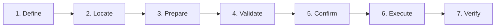

import { Card, CardGrid, Aside, Tabs, TabItem } from '@astrojs/starlight/components';

People don't buy products—they **hire** them to get jobs done. This page documents the specific jobs users hire caro to perform, using the canonical JTBD framework from Anthony Ulwick's Outcome-Driven Innovation methodology.

## The JTBD Lens

<CardGrid>
  <Card title="Jobs, Not Features" icon="puzzle">
    Users don't care about caro's 52 safety patterns or bundled model. They care about **not breaking production** and **getting work done** even when offline.
  </Card>
  <Card title="Hiring and Firing" icon="random">
    When users "hire" caro, they're "firing" something else—manual review, Google searches, or cloud-dependent AI tools. Understanding what gets fired reveals the real job.
  </Card>
  <Card title="Three Job Types" icon="list-format">
    **Functional:** Tasks to accomplish. **Emotional:** How users want to feel. **Social:** How users want to be perceived.
  </Card>
</CardGrid>

---

## Core Functional Jobs

Jobs use the canonical format: **When** [situation], **I want to** [motivation], **so I can** [outcome].

### Safe Command Execution

> **When** I'm about to run a command in production, **I want to** validate it won't cause damage, **so I can** prevent outages and keep my systems running.

| Attribute | Value |
|-----------|-------|
| Importance | Critical |
| Frequency | Daily |
| Satisfaction Gap | High |

### Offline AI Assistance

> **When** I'm working in an air-gapped or restricted environment, **I want to** get AI assistance without network access, **so I can** be productive even when isolated from the internet.

| Attribute | Value |
|-----------|-------|
| Importance | Critical |
| Frequency | Daily |
| Satisfaction Gap | Very High |

### Natural Language to Commands

> **When** I know what I want to do but not the exact command syntax, **I want to** describe my intent in plain English, **so I can** get a working command without searching documentation.

| Attribute | Value |
|-----------|-------|
| Importance | High |
| Frequency | Daily |
| Satisfaction Gap | Medium |

### Cross-Platform Commands

> **When** I'm writing commands that need to work on Mac, Linux, and CI, **I want to** generate platform-aware commands automatically, **so I can** stop debugging BSD vs GNU flag differences.

| Attribute | Value |
|-----------|-------|
| Importance | High |
| Frequency | Weekly |
| Satisfaction Gap | High |

### Incident Response

> **When** I'm troubleshooting an incident at 3 AM, **I want to** get commands quickly without making mistakes, **so I can** resolve incidents faster without causing additional damage.

| Attribute | Value |
|-----------|-------|
| Importance | Critical |
| Frequency | Weekly |
| Satisfaction Gap | High |

### Team Safety Standards

> **When** I'm responsible for my team's command-line safety, **I want to** deploy safety standards without micromanaging, **so I can** protect my team from dangerous commands automatically.

| Attribute | Value |
|-----------|-------|
| Importance | High |
| Frequency | Monthly |
| Satisfaction Gap | Very High |

---

## Emotional Jobs

How users want to **feel** when doing their work.

<Tabs>
  <TabItem label="Confidence">
    **Job:** Feel confident when running production commands

    **Pain Point:** Anxiety about accidentally breaking things

    **How caro helps:** Deterministic safety validation provides certainty before execution
  </TabItem>
  <TabItem label="Control">
    **Job:** Feel in control during high-pressure incidents

    **Pain Point:** Stress leads to mistakes, mistakes make incidents worse

    **How caro helps:** Fast, offline-capable assistance when you need it most
  </TabItem>
  <TabItem label="Competence">
    **Job:** Feel competent despite not memorizing every flag

    **Pain Point:** Imposter syndrome when forgetting basic commands

    **How caro helps:** Natural language interface lets you focus on intent, not syntax
  </TabItem>
  <TabItem label="Security">
    **Job:** Feel secure working in restricted environments

    **Pain Point:** Other tools require internet, leaving you stranded

    **How caro helps:** Bundled model works where nothing else can
  </TabItem>
</Tabs>

---

## Social Jobs

How users want to be **perceived** by others.

| Job | Context | How caro helps |
|-----|---------|----------------|
| Be seen as careful and professional | Team environments where mistakes are visible | Visible safety validation shows diligence to colleagues |
| Be seen as the person who prevents incidents | Engineering teams that value reliability | Catches dangerous commands before they cause problems |
| Be seen as security-conscious | Organizations with compliance requirements | Offline operation and zero telemetry satisfy security teams |

---

## Job Triggers

Events that cause users to actively seek a solution:

<Aside type="caution" title="Immediate Urgency">
- **Near-miss incident** — Almost ran a dangerous command, caught it just in time
- **Actual incident caused by command error** — Production outage from typo or wrong flags
</Aside>

<Aside type="tip" title="High Urgency">
- **New air-gapped deployment** — Moved to restricted environment, existing tools don't work
- **Security audit** — Need to document and enforce command-line safety standards
</Aside>

<Aside type="note" title="Medium Urgency">
- **Cross-platform migration** — Moving from Mac to Linux or vice versa, commands breaking
- **Team growth** — New engineers joining who might make dangerous mistakes
</Aside>

---

## Desired Outcomes

What users measure success by (Outcome-Driven Innovation format):

| Outcome Statement | Metric | Without caro | With caro |
|-------------------|--------|--------------|-----------|
| Minimize the time to validate a command is safe | Seconds from command to verdict | 30-60s (manual review) | **\<100ms** |
| Minimize likelihood of running destructive commands | Dangerous commands executed/month | Varies by vigilance | **Zero** (blocked) |
| Minimize time to get a working command | Seconds from intent to command | 2-5 min (Google + trial/error) | **\<2s** inference |
| Minimize dependency on network connectivity | % functionality available offline | 0% (cloud AI tools) | **100%** (bundled) |
| Minimize cross-platform debugging time | Time debugging BSD vs GNU | 15-30 min per issue | **Zero** (platform-aware) |

---

## Hiring and Firing

What solutions users "fire" when they "hire" caro:

### Command Validation
- **Fires:** Manual review, hope and prayer, bash aliases with safety checks
- **Hires:** caro's deterministic pattern matching
- **Because:** Can't hallucinate, doesn't require vigilance

### AI Shell Assistance
- **Fires:** ChatGPT (requires network), Copilot CLI (requires network), Stack Overflow searches
- **Hires:** caro's offline-first AI
- **Because:** Works in restricted environments, no cloud dependency

### Command Learning
- **Fires:** Man pages, TLDR pages, Google searches
- **Hires:** caro's natural language interface
- **Because:** Describe intent, get working commands instantly

### Cross-Platform Scripting
- **Fires:** Trial and error, maintaining separate scripts, conditional shell logic
- **Hires:** caro's platform detection
- **Because:** Generates correct flags for current platform

---

## Job Map: Safe Command Execution

Step-by-step breakdown of the core job:

| Step | Action | Example | caro's Role |
|------|--------|---------|-------------|
| **Define** | Decide what action to take | "I need to delete old log files" | Understands natural language intent |
| **Locate** | Identify what to operate on | "Files older than 30 days in /var/log" | Generates correct find/date syntax |
| **Prepare** | Formulate the command | `find /var/log -mtime +30 -delete` | Creates platform-correct command |
| **Validate** | Check command is safe | "Is this going to delete something important?" | Matches against 52+ dangerous patterns |
| **Confirm** | Make go/no-go decision | Safe verdict gives confidence to proceed | Clear safety status with explanations |
| **Execute** | Run the command | Press enter with confidence | Optional: direct execution with safety gate |
| **Verify** | Confirm expected result | Check files were deleted correctly | Can generate verification commands |

---

## The Core Insight

<Aside type="tip" title="Why People Hire caro">
Users don't hire caro because it has a bundled AI model or 52 safety patterns. They hire caro because they want to **feel confident running commands**, **get work done in any environment**, and **protect their systems from their own mistakes**.

The functional job is command safety. The emotional job is peace of mind. The social job is being seen as careful and professional.
</Aside>
