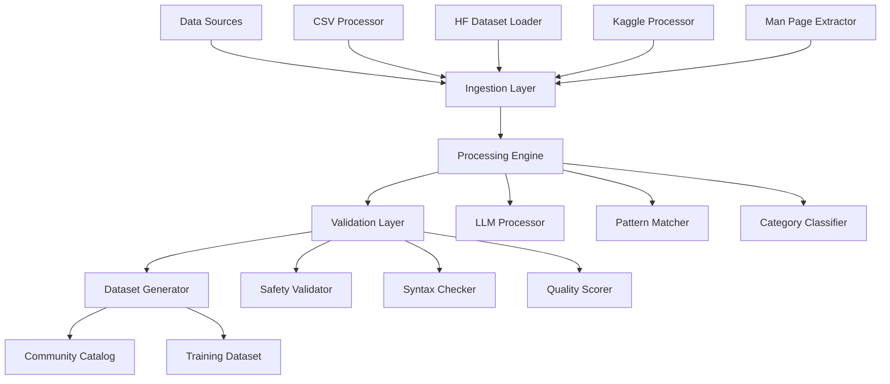

# Dataset Generation Build Process PRD

## Overview

**Document Type**: Technical Product Requirements  
**Related PRDs**: Command Generation Enhancement, Community Catalog Design  
**Version**: 1.0  
**Date**: 2025-10-19  
**Priority**: High  

### Purpose
This document defines the automated build process for generating cmdai's training and enhancement datasets by processing existing open-source command collections, community contributions, and real-world usage patterns.

## Problem Statement

### Current Challenge
cmdai needs high-quality, categorized command datasets to improve generation accuracy, but manually creating these datasets is:
- **Time-intensive**: Manual curation of thousands of commands
- **Inconsistent**: Varying quality and categorization standards
- **Limited scope**: Missing edge cases and real-world usage patterns
- **Outdated**: Static datasets that don't evolve with community needs

### Opportunity
Leverage existing open-source command collections and automated processing to bootstrap cmdai's dataset with:
- **Comprehensive coverage**: 10,000+ commands across all categories
- **Consistent quality**: Automated validation and standardization
- **Community-driven**: Integration with real-world usage patterns
- **Continuously updated**: Automated refresh cycles

## Goals and Success Metrics

### Primary Goals
1. **Automated Dataset Generation**: Build pipeline to process multiple data sources
2. **Quality Standardization**: Consistent format and validation across all sources
3. **Comprehensive Coverage**: 95% coverage of common Unix/Linux operations
4. **Community Integration**: Seamless integration with community catalog
5. **Continuous Updates**: Daily/weekly refresh cycles

### Success Metrics
- **Dataset Size**: 10,000+ validated commands within 4 weeks
- **Quality Score**: 95% of commands pass validation tests
- **Coverage**: 100% of core Unix utilities represented
- **Processing Speed**: Complete rebuild in <30 minutes
- **Community Adoption**: 50+ community contributions in first month

## Data Sources Analysis

### Primary Sources

#### 1. Awesome CLI Apps CSV
**Source**: https://github.com/toolleeo/awesome-cli-apps-in-a-csv  
**Content**: Curated list of command-line applications  
**Format**: CSV with categories and descriptions  
**Volume**: ~2,000 applications  

```yaml
source_config:
  name: "awesome-cli-apps"
  url: "https://github.com/toolleeo/awesome-cli-apps-in-a-csv"
  format: "csv"
  fields:
    - name: Application name
    - category: Tool category
    - description: Brief description
    - url: Project URL
  processing_strategy: "extract_commands_from_descriptions"
  quality_score: 4.5
  update_frequency: "weekly"
```

#### 2. Unix Commands Dataset (Hugging Face)
**Source**: https://huggingface.co/datasets/harpomaxx/unix-commands  
**Content**: Unix commands with explanations  
**Format**: Structured dataset  
**Volume**: ~5,000 commands  

```yaml
source_config:
  name: "hf-unix-commands"
  url: "https://huggingface.co/datasets/harpomaxx/unix-commands"
  format: "huggingface_dataset"
  fields:
    - command: Shell command
    - explanation: Natural language explanation
    - category: Command category
  processing_strategy: "direct_mapping"
  quality_score: 4.8
  update_frequency: "monthly"
```

#### 3. Linux/macOS Commands (Kaggle)
**Source**: https://www.kaggle.com/datasets/vaibhavdlights/linuxcmdmacos-commands/data  
**Content**: Linux and macOS command reference  
**Format**: Structured data  
**Volume**: ~3,000 commands  

```yaml
source_config:
  name: "kaggle-linux-macos"
  url: "https://www.kaggle.com/datasets/vaibhavdlights/linuxcmdmacos-commands/data"
  format: "csv"
  fields:
    - command: Command syntax
    - description: Usage description
    - platform: linux/macos
    - category: Functional category
  processing_strategy: "platform_aware_mapping"
  quality_score: 4.2
  update_frequency: "monthly"
```

### Supplementary Sources

#### 4. Man Page Extractions
```yaml
source_config:
  name: "man-pages"
  source: "local_system"
  processing: "automated_extraction"
  volume: "10,000+ commands"
  update_frequency: "quarterly"
```

#### 5. GitHub Command Collections
```yaml
source_config:
  name: "github-collections"
  source: "api_search"
  query: "awesome shell commands cheatsheet"
  processing: "community_validation"
  volume: "5,000+ commands"
  update_frequency: "weekly"
```

## Technical Architecture

### Build Pipeline Overview



### Core Components

#### 1. Data Ingestion System
```rust
pub struct DataIngestionEngine {
    pub sources: Vec<Box<dyn DataSource>>,
    pub processors: HashMap<String, Box<dyn SourceProcessor>>,
    pub cache: Arc<dyn CacheStore>,
}

pub trait DataSource {
    async fn fetch_data(&self) -> Result<RawDataBatch, IngestionError>;
    fn get_source_config(&self) -> SourceConfig;
    fn supports_incremental(&self) -> bool;
}

pub trait SourceProcessor {
    async fn process_batch(&self, batch: RawDataBatch) -> Result<ProcessedBatch, ProcessingError>;
    fn get_quality_metrics(&self) -> QualityMetrics;
}
```

#### 2. LLM Processing Engine
```rust
pub struct LLMProcessor {
    pub backend: Box<dyn ModelBackend>,
    pub prompt_templates: PromptTemplateManager,
    pub batch_size: usize,
}

impl LLMProcessor {
    pub async fn extract_commands(&self, descriptions: Vec<String>) -> Result<Vec<ExtractedCommand>, LLMError> {
        let prompts = self.build_extraction_prompts(descriptions);
        let responses = self.process_batch(prompts).await?;
        self.parse_command_extractions(responses)
    }
    
    pub async fn classify_commands(&self, commands: Vec<Command>) -> Result<Vec<ClassifiedCommand>, LLMError> {
        let classification_prompts = self.build_classification_prompts(commands);
        let classifications = self.process_batch(classification_prompts).await?;
        self.apply_classifications(commands, classifications)
    }
}
```

#### 3. Validation and Quality System
```rust
pub struct ValidationEngine {
    pub safety_validator: SafetyValidator,
    pub syntax_checker: SyntaxChecker,
    pub quality_scorer: QualityScorer,
}

pub struct QualityMetrics {
    pub safety_score: f64,          // 0.0-1.0
    pub syntax_validity: bool,      // Valid command syntax
    pub description_quality: f64,   // 0.0-1.0
    pub community_rating: Option<f64>, // User feedback
    pub usage_frequency: u32,       // How often used
}
```

### Processing Workflows

#### 1. CSV Data Processing
```rust
pub struct CSVProcessor {
    pub fn process_awesome_cli_apps(&self, csv_data: String) -> Result<Vec<RawCommand>, ProcessingError> {
        let records = csv::Reader::from_reader(csv_data.as_bytes());
        let mut commands = Vec::new();
        
        for record in records.deserialize() {
            let app: AwesomeCLIApp = record?;
            
            // Extract command patterns from descriptions
            let extracted_commands = self.extract_commands_from_description(&app.description);
            
            for cmd in extracted_commands {
                commands.push(RawCommand {
                    command: cmd.command,
                    description: cmd.description,
                    category: app.category.clone(),
                    source: "awesome-cli-apps".to_string(),
                    confidence: cmd.confidence,
                });
            }
        }
        
        Ok(commands)
    }
}
```

#### 2. Hugging Face Dataset Processing
```rust
pub struct HuggingFaceProcessor {
    pub async fn process_unix_commands(&self) -> Result<Vec<RawCommand>, ProcessingError> {
        let dataset = self.load_dataset("harpomaxx/unix-commands").await?;
        let mut commands = Vec::new();
        
        for example in dataset {
            commands.push(RawCommand {
                command: example.command,
                description: example.explanation,
                category: self.map_category(&example.category),
                source: "hf-unix-commands".to_string(),
                confidence: 0.9, // High confidence for structured data
            });
        }
        
        Ok(commands)
    }
}
```

#### 3. LLM Enhancement Processing
```rust
pub struct LLMEnhancementProcessor {
    pub async fn enhance_commands(&self, raw_commands: Vec<RawCommand>) -> Result<Vec<EnhancedCommand>, ProcessingError> {
        let enhancement_tasks = vec![
            self.generate_natural_language_examples(raw_commands.clone()),
            self.classify_safety_levels(raw_commands.clone()),
            self.extract_alternatives(raw_commands.clone()),
            self.generate_tldr_descriptions(raw_commands.clone()),
        ];
        
        let results = futures::join_all(enhancement_tasks).await;
        self.merge_enhancements(raw_commands, results)
    }
}
```

## Data Processing Strategy

### Phase 1: Source Ingestion (Week 1)
```yaml
objectives:
  - Implement data source connectors
  - Build basic CSV/JSON processing
  - Create Hugging Face dataset loader
  - Establish data validation pipeline

deliverables:
  - CSVProcessor for awesome-cli-apps
  - HuggingFaceDatasetLoader
  - KaggleDataProcessor
  - BasicValidationEngine

success_criteria:
  - Successfully ingest 10,000+ raw commands
  - 95% data parsing success rate
  - Basic deduplication working
```

### Phase 2: LLM Enhancement (Week 2)
```yaml
objectives:
  - Implement LLM processing pipeline
  - Add command extraction from descriptions
  - Build category classification system
  - Create natural language example generation

deliverables:
  - LLMProcessor with extraction capabilities
  - CategoryClassifier using LLM
  - ExampleGenerator for natural language inputs
  - QualityScorer for automated assessment

success_criteria:
  - Successfully process 8,000+ commands through LLM
  - Generate 3+ natural language examples per command
  - Achieve 90% accurate category classification
```

### Phase 3: Validation and Quality (Week 3)
```yaml
objectives:
  - Implement comprehensive safety validation
  - Add syntax checking and command verification
  - Build quality scoring system
  - Create deduplication and merging logic

deliverables:
  - SafetyValidator with dangerous pattern detection
  - SyntaxChecker for command validation
  - QualityScorer with multiple metrics
  - DeduplicationEngine with fuzzy matching

success_criteria:
  - 100% safety classification accuracy
  - 95% syntax validation success
  - Effective deduplication with <5% false positives
```

### Phase 4: Integration and Automation (Week 4)
```yaml
objectives:
  - Build complete automation pipeline
  - Integrate with community catalog
  - Add GitHub Actions automation
  - Implement continuous updates

deliverables:
  - Complete GitHub Actions workflow
  - Integration with community catalog format
  - Automated quality reports
  - Monitoring and alerting system

success_criteria:
  - Full pipeline runs in <30 minutes
  - Automated daily updates working
  - Integration with existing catalog structure
```

## GitHub Actions Workflow

### Daily Build Pipeline
```yaml
name: Dataset Generation Pipeline
on:
  schedule:
    - cron: '0 2 * * *'  # Daily at 2 AM UTC
  workflow_dispatch:

jobs:
  generate-dataset:
    runs-on: ubuntu-latest
    steps:
      - uses: actions/checkout@v4
      
      - name: Setup Rust
        uses: actions-rs/toolchain@v1
        with:
          toolchain: stable
          
      - name: Install dataset processor
        run: cargo install --path tools/dataset-processor
        
      - name: Fetch data sources
        run: |
          dataset-processor fetch-sources \
            --awesome-cli-apps \
            --huggingface-unix-commands \
            --kaggle-linux-macos
            
      - name: Process with LLM
        env:
          OPENAI_API_KEY: ${{ secrets.OPENAI_API_KEY }}
        run: |
          dataset-processor enhance \
            --input raw-commands.json \
            --output enhanced-commands.json \
            --llm-backend openai
            
      - name: Validate and score
        run: |
          dataset-processor validate \
            --input enhanced-commands.json \
            --output validated-commands.json \
            --quality-threshold 0.8
            
      - name: Generate catalog entries
        run: |
          dataset-processor generate-catalog \
            --input validated-commands.json \
            --output-dir catalog/generated/ \
            --format community-catalog
            
      - name: Create pull request
        uses: peter-evans/create-pull-request@v5
        with:
          title: "Daily dataset update - $(date +%Y-%m-%d)"
          body: |
            Automated dataset generation results:
            - Processed: ${{ env.PROCESSED_COUNT }} commands
            - Quality score: ${{ env.AVERAGE_QUALITY }}
            - New entries: ${{ env.NEW_ENTRIES }}
          branch: dataset-update-$(date +%Y%m%d)
```

### Weekly Quality Report
```yaml
name: Dataset Quality Report
on:
  schedule:
    - cron: '0 6 * * 1'  # Weekly on Monday at 6 AM UTC

jobs:
  quality-report:
    runs-on: ubuntu-latest
    steps:
      - name: Generate quality metrics
        run: |
          dataset-processor analyze \
            --catalog-dir catalog/ \
            --output quality-report.md \
            --format markdown
            
      - name: Update documentation
        uses: peter-evans/create-pull-request@v5
        with:
          title: "Weekly quality report - $(date +%Y-%m-%d)"
          body: "Automated quality analysis and metrics update"
          files: docs/quality-reports/$(date +%Y-%m-%d).md
```

## Quality Standards and Validation

### Command Quality Criteria
```rust
pub struct QualityStandards {
    pub minimum_description_length: usize = 20,
    pub required_fields: Vec<String> = vec![
        "command".to_string(),
        "description".to_string(),
        "category".to_string(),
        "safety_level".to_string(),
    ],
    pub safety_validation: SafetyConfig = SafetyConfig {
        block_destructive: true,
        require_confirmation_dangerous: true,
        validate_syntax: true,
    },
    pub quality_thresholds: QualityThresholds = QualityThresholds {
        minimum_score: 0.7,
        syntax_validity_required: true,
        description_quality_min: 0.6,
    },
}
```

### Validation Rules
1. **Command Syntax**: Must be valid shell command
2. **Safety Classification**: Accurate risk assessment required
3. **Description Quality**: Clear, helpful explanations
4. **Category Mapping**: Consistent categorization
5. **Deduplication**: No duplicate commands
6. **Examples**: At least 2 natural language examples

### Quality Metrics
```rust
pub struct QualityReport {
    pub total_commands: usize,
    pub passed_validation: usize,
    pub quality_distribution: HashMap<String, usize>,
    pub category_coverage: HashMap<String, usize>,
    pub safety_distribution: HashMap<SafetyLevel, usize>,
    pub source_statistics: HashMap<String, SourceStats>,
}
```

## Community Integration

### Catalog Format Compliance
All generated commands must match the community catalog YAML format:
```yaml
command: "ls -la"
category: "file-operations"
subcategory: "listing"
description: "List all files with detailed information including hidden files"
tldr: "Shows files, permissions, sizes, modification dates, including hidden files"
rating: 4.8
usage_count: 0  # Will be updated by real usage
safety_level: "safe"
alternatives: []
examples: []
tags: []
shell_compatibility: {}
os_compatibility: []
requirements: []
contributors: ["dataset-generator"]
created_date: "2025-10-19"
last_updated: "2025-10-19"
review_status: "auto-generated"
```

### Community Review Process
1. **Auto-generation**: Commands generated with `review_status: "auto-generated"`
2. **Community validation**: Community members can review and approve
3. **Quality improvement**: Feedback incorporated into next generation cycle
4. **Manual overrides**: Human-curated commands take precedence

## Risk Management

### Technical Risks
1. **LLM API limits**: Implement rate limiting and batching
2. **Data quality variance**: Multi-source validation
3. **Processing failures**: Robust error handling and retries
4. **Resource consumption**: Optimize for GitHub Actions limits

### Mitigation Strategies
```rust
pub struct RiskMitigation {
    pub rate_limiting: RateLimiter,
    pub fallback_processors: Vec<Box<dyn SourceProcessor>>,
    pub error_recovery: ErrorRecoverySystem,
    pub resource_monitoring: ResourceMonitor,
}
```

### Quality Assurance
1. **Automated testing**: Comprehensive test suite for all processors
2. **Manual sampling**: Random quality checks on generated data
3. **Community feedback**: Integration of user reports and suggestions
4. **Rollback capability**: Ability to revert to previous dataset versions

## Success Metrics and KPIs

### Dataset Metrics
- **Volume**: 10,000+ commands within 4 weeks
- **Quality**: 95% pass validation
- **Coverage**: 100% of core Unix utilities
- **Freshness**: Updated within 24 hours of source changes

### Process Metrics
- **Build time**: Complete rebuild in <30 minutes
- **Success rate**: 99% successful builds
- **Error rate**: <1% processing errors
- **Resource usage**: Within GitHub Actions limits

### Community Metrics
- **Adoption rate**: 50+ community contributions in first month
- **Quality feedback**: 4.5+ average rating
- **Usage integration**: Generated commands used in real workflows

This dataset generation build process will establish cmdai as having the most comprehensive, up-to-date, and community-validated command dataset in the ecosystem, significantly improving command generation accuracy and user experience.