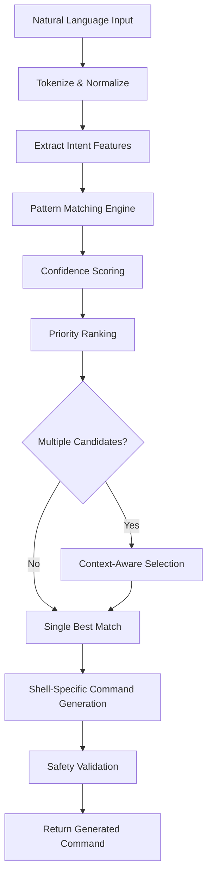

# Decision Tree Command Generation Algorithm PRD

## Overview

**Document Type**: Technical Product Requirements  
**Related PRDs**: Backend Architecture, Command Generation Enhancement  
**Version**: 1.0  
**Date**: 2025-10-20  
**Priority**: High  

### Purpose
This document defines the algorithmic approach for the Decision Tree Backend, which replaces the current complex if/else chain mock backend with a sophisticated pattern matching and confidence scoring system.

## Problem Statement

### Current Implementation Issues
The existing inline mock backend in `src/cli/mod.rs` has several critical problems:

1. **Complex Nested Logic**: ~100 lines of nested if/else statements that are hard to maintain
2. **No Confidence Scoring**: Binary pattern matching without probability assessment
3. **Poor Extensibility**: Adding new patterns requires deep code changes
4. **No Priority System**: All patterns are evaluated equally
5. **Limited Context**: No consideration of command history or user preferences

### Example of Current Problematic Code
```rust
// Current complex if/else chain (simplified)
let command = if (input_lower.contains("list") || input_lower.contains("show") || input_lower.contains("what")) && input_lower.contains("files") {
    if input_lower.contains("all") || input_lower.contains("hidden") {
        match request.shell {
            ShellType::PowerShell => "Get-ChildItem -Force".to_string(),
            ShellType::Cmd => "dir /A".to_string(),
            _ => "ls -la".to_string(),
        }
    } else {
        // More nested logic...
    }
} else if /* 10+ more complex conditions */ {
    // Even more nested logic...
}
```

## Solution: Algorithmic Decision Tree

### Core Algorithm Design

#### 1. Pattern Definition System
```rust
#[derive(Debug, Clone, Serialize, Deserialize)]
pub struct CommandPattern {
    pub id: String,
    pub intent: CommandIntent,
    pub triggers: Vec<PatternTrigger>,
    pub shell_commands: HashMap<ShellType, String>,
    pub confidence_base: f64,  // Base confidence score (0.0-1.0)
    pub priority: u32,         // Lower number = higher priority
    pub safety_level: RiskLevel,
    pub context_requirements: Vec<ContextRequirement>,
}

#[derive(Debug, Clone)]
pub enum PatternTrigger {
    ContainsAll(Vec<String>),      // All words must be present
    ContainsAny(Vec<String>),      // Any word must be present  
    Regex(String),                 // Regex pattern match
    Semantic(String, f64),         // Semantic similarity with threshold
    Composite(CompositeCondition), // Complex logical conditions
}

#[derive(Debug, Clone)]
pub enum CommandIntent {
    FileOperations,
    DirectoryNavigation,
    SystemInfo,
    ProcessManagement,
    NetworkOperations,
    Development,
    Administration,
    Custom(String),
}
```

#### 2. Decision Tree Algorithm Flow



#### 3. Confidence Scoring System
```rust
pub struct ConfidenceCalculator {
    pattern_weights: HashMap<String, f64>,
    context_weights: HashMap<String, f64>,
    history_weights: HashMap<String, f64>,
}

impl ConfidenceCalculator {
    pub fn calculate_confidence(&self, input: &str, pattern: &CommandPattern, context: &CommandContext) -> f64 {
        let mut score = pattern.confidence_base;
        
        // Pattern match scoring
        for trigger in &pattern.triggers {
            score += self.evaluate_trigger(input, trigger);
        }
        
        // Context enhancement
        score += self.evaluate_context(context, &pattern.context_requirements);
        
        // Historical preference boosting
        score += self.evaluate_history(input, pattern, context.history);
        
        // Normalize to 0.0-1.0 range
        score.min(1.0).max(0.0)
    }
    
    fn evaluate_trigger(&self, input: &str, trigger: &PatternTrigger) -> f64 {
        match trigger {
            PatternTrigger::ContainsAll(words) => {
                let matches = words.iter().filter(|w| input.contains(*w)).count();
                (matches as f64) / (words.len() as f64) * 0.3
            },
            PatternTrigger::ContainsAny(words) => {
                if words.iter().any(|w| input.contains(w)) { 0.2 } else { 0.0 }
            },
            PatternTrigger::Regex(pattern) => {
                if regex::Regex::new(pattern).unwrap().is_match(input) { 0.4 } else { 0.0 }
            },
            PatternTrigger::Semantic(target, threshold) => {
                let similarity = self.semantic_similarity(input, target);
                if similarity > *threshold { similarity * 0.5 } else { 0.0 }
            },
            PatternTrigger::Composite(condition) => {
                self.evaluate_composite(input, condition)
            }
        }
    }
}
```

### Built-in Pattern Library

#### File Operations Patterns
```yaml
file_listing_basic:
  intent: FileOperations
  triggers:
    - contains_all: ["list", "files"]
    - contains_any: ["show", "display", "what"]
  shell_commands:
    bash: "ls"
    zsh: "ls" 
    powershell: "Get-ChildItem"
    cmd: "dir"
  confidence_base: 0.8
  priority: 10
  safety_level: Safe

file_listing_detailed:
  intent: FileOperations
  triggers:
    - contains_all: ["list", "files"]
    - contains_any: ["all", "detailed", "long", "hidden"]
  shell_commands:
    bash: "ls -la"
    zsh: "ls -la"
    powershell: "Get-ChildItem -Force"
    cmd: "dir /A"
  confidence_base: 0.9
  priority: 5  # Higher priority than basic
  safety_level: Safe

file_search:
  intent: FileOperations
  triggers:
    - contains_all: ["find", "files"]
    - regex: "find.*\\.\\w+"
  shell_commands:
    bash: "find . -name '*.txt'"
    zsh: "find . -name '*.txt'"
    powershell: "Get-ChildItem -Recurse -Filter *.txt"
  confidence_base: 0.85
  priority: 15
  safety_level: Safe
```

#### System Information Patterns
```yaml
current_directory:
  intent: DirectoryNavigation
  triggers:
    - contains_any: ["pwd", "current directory", "where am i"]
    - semantic: ["current location", 0.8]
  shell_commands:
    bash: "pwd"
    zsh: "pwd"
    powershell: "Get-Location"
    cmd: "cd"
  confidence_base: 0.95
  priority: 1
  safety_level: Safe

system_time:
  intent: SystemInfo
  triggers:
    - contains_any: ["time", "date", "when"]
    - regex: "what.*time.*is.*it"
  shell_commands:
    bash: "date"
    zsh: "date"
    powershell: "Get-Date"
    cmd: "time"
  confidence_base: 0.9
  priority: 5
  safety_level: Safe
```

### Context-Aware Enhancement

#### Command History Integration
```rust
pub struct CommandContext {
    pub current_directory: PathBuf,
    pub shell_type: ShellType,
    pub recent_commands: Vec<String>,
    pub user_preferences: UserPreferences,
    pub environment_vars: HashMap<String, String>,
    pub session_history: Vec<CommandExecution>,
}

pub struct HistoryAnalyzer {
    pub pattern_frequency: HashMap<String, u32>,
    pub success_rates: HashMap<String, f64>,
    pub user_modifications: HashMap<String, String>,
}

impl HistoryAnalyzer {
    pub fn boost_confidence(&self, pattern: &CommandPattern, base_confidence: f64) -> f64 {
        let frequency_boost = self.pattern_frequency
            .get(&pattern.id)
            .map(|freq| (*freq as f64) * 0.01)
            .unwrap_or(0.0);
            
        let success_boost = self.success_rates
            .get(&pattern.id)
            .map(|rate| rate * 0.1)
            .unwrap_or(0.0);
            
        (base_confidence + frequency_boost + success_boost).min(1.0)
    }
}
```

#### User Preference Learning
```rust
pub struct UserPreferences {
    pub preferred_verbosity: VerbosityLevel,
    pub shell_specific_preferences: HashMap<ShellType, ShellPreferences>,
    pub command_aliases: HashMap<String, String>,
    pub safety_preferences: SafetyPreferences,
}

#[derive(Debug, Clone)]
pub enum VerbosityLevel {
    Minimal,    // "ls" instead of "ls -la"
    Standard,   // Default behavior
    Verbose,    // Always include verbose flags
    Detailed,   // Maximum information
}
```

### Performance Optimization

#### Pattern Indexing
```rust
pub struct PatternIndex {
    keyword_index: HashMap<String, Vec<usize>>,    // Word -> Pattern IDs
    intent_index: HashMap<CommandIntent, Vec<usize>>, // Intent -> Pattern IDs
    regex_patterns: Vec<(regex::Regex, usize)>,    // Compiled regexes
    priority_queue: BinaryHeap<PriorityPattern>,   // Pre-sorted by priority
}

impl PatternIndex {
    pub fn quick_lookup(&self, input: &str) -> Vec<usize> {
        let words: Vec<&str> = input.split_whitespace().collect();
        let mut candidates = HashSet::new();
        
        // Fast keyword lookup
        for word in words {
            if let Some(pattern_ids) = self.keyword_index.get(word) {
                candidates.extend(pattern_ids);
            }
        }
        
        candidates.into_iter().collect()
    }
}
```

#### Caching Strategy
```rust
pub struct DecisionCache {
    lru_cache: LruCache<String, CachedDecision>,
    confidence_threshold: f64,
    max_cache_size: usize,
}

#[derive(Debug, Clone)]
pub struct CachedDecision {
    pub command: String,
    pub confidence: f64,
    pub pattern_id: String,
    pub timestamp: SystemTime,
    pub context_hash: u64,
}
```

## Implementation Architecture

### Core Components

#### 1. DecisionTreeBackend
```rust
pub struct DecisionTreeBackend {
    patterns: PatternLibrary,
    confidence_calculator: ConfidenceCalculator,
    pattern_index: PatternIndex,
    cache: DecisionCache,
    history_analyzer: HistoryAnalyzer,
    config: DecisionTreeConfig,
}

#[async_trait]
impl CommandGenerator for DecisionTreeBackend {
    async fn generate_command(&self, request: &CommandRequest) -> Result<GeneratedCommand, GeneratorError> {
        // 1. Check cache first
        if let Some(cached) = self.cache.get(&request.input) {
            return Ok(cached.into_generated_command());
        }
        
        // 2. Fast pattern lookup
        let candidate_patterns = self.pattern_index.quick_lookup(&request.input);
        
        // 3. Calculate confidence scores
        let scored_patterns = self.score_patterns(&request.input, &candidate_patterns, request);
        
        // 4. Select best pattern
        let best_pattern = self.select_best_pattern(scored_patterns)?;
        
        // 5. Generate shell-specific command
        let command = self.generate_shell_command(&best_pattern, request.shell)?;
        
        // 6. Cache result
        self.cache.insert(request.input.clone(), &command, best_pattern.confidence);
        
        Ok(command)
    }
}
```

#### 2. Pattern Loading System
```rust
pub struct PatternLibrary {
    patterns: Vec<CommandPattern>,
    loaded_sources: Vec<PatternSource>,
}

#[derive(Debug, Clone)]
pub enum PatternSource {
    BuiltIn,                    // Hardcoded patterns in code
    ConfigFile(PathBuf),        // YAML/JSON pattern files
    UserDefined(PathBuf),       // User's custom patterns
    CommunityRepo(String),      // Downloaded from community
    LearningEngine,             // Patterns learned from usage
}

impl PatternLibrary {
    pub async fn load_all_sources(&mut self) -> Result<(), PatternError> {
        // Load built-in patterns
        self.load_builtin_patterns()?;
        
        // Load configuration file patterns
        if let Some(config_path) = self.find_config_patterns() {
            self.load_from_file(config_path).await?;
        }
        
        // Load user-defined patterns
        if let Some(user_path) = self.find_user_patterns() {
            self.load_from_file(user_path).await?;
        }
        
        // Build indexes for fast lookup
        self.build_indexes()?;
        
        Ok(())
    }
}
```

### Configuration

#### Decision Tree Configuration
```rust
#[derive(Debug, Clone, Serialize, Deserialize)]
pub struct DecisionTreeConfig {
    pub confidence_threshold: f64,        // Minimum confidence to return result
    pub max_candidates: usize,             // Maximum patterns to evaluate
    pub cache_size: usize,                 // LRU cache size
    pub enable_learning: bool,             // Learn from user feedback
    pub pattern_sources: Vec<PatternSource>, // Which pattern sources to load
    pub fallback_command: String,          // What to return if no pattern matches
    pub semantic_model_path: Option<PathBuf>, // Path to semantic similarity model
}

impl Default for DecisionTreeConfig {
    fn default() -> Self {
        Self {
            confidence_threshold: 0.7,
            max_candidates: 10,
            cache_size: 1000,
            enable_learning: true,
            pattern_sources: vec![
                PatternSource::BuiltIn,
                PatternSource::ConfigFile("~/.cmdai/patterns.yaml".into()),
            ],
            fallback_command: "echo 'Command not recognized'".to_string(),
            semantic_model_path: None,
        }
    }
}
```

## Success Metrics

### Algorithm Performance
- **Pattern Match Speed**: <5ms for pattern lookup and scoring
- **Cache Hit Rate**: >80% for repeated commands
- **Confidence Accuracy**: >90% correlation between confidence and user satisfaction
- **Memory Usage**: <50MB for pattern library and cache

### User Experience
- **Command Accuracy**: >95% for common operations (better than current mock)
- **Learning Speed**: Adaptation to user preferences within 10 commands
- **Extensibility**: New patterns addable without code changes
- **Fallback Quality**: Graceful degradation when no patterns match

### Maintainability
- **Code Complexity**: Reduce from 100+ lines of if/else to algorithmic approach
- **Pattern Addition**: New commands via configuration, not code changes
- **Testing**: Each pattern independently testable
- **Documentation**: Self-documenting pattern library

## Migration Strategy

### Phase 1: Extract Current Logic
- Move existing if/else patterns to YAML pattern definitions
- Implement basic DecisionTreeBackend with static patterns
- Ensure 100% compatibility with existing tests

### Phase 2: Enhance Algorithm
- Add confidence scoring system
- Implement pattern indexing for performance
- Add caching layer

### Phase 3: Advanced Features
- Add semantic similarity matching
- Implement user preference learning
- Add community pattern loading

### Phase 4: Production Optimization
- Performance tuning and optimization
- Comprehensive testing and validation
- Documentation and examples

## Risk Mitigation

### Technical Risks
1. **Performance Regression**: Mitigated by indexing and caching
2. **Pattern Conflicts**: Mitigated by priority system and confidence scoring
3. **Memory Usage**: Mitigated by LRU cache and pattern compression
4. **Semantic Model Size**: Optional feature with fallback to keyword matching

### User Experience Risks
1. **Accuracy Regression**: Mitigated by comprehensive test suite
2. **Response Time**: Mitigated by aggressive caching and optimization
3. **Learning Curve**: Mitigated by maintaining backward compatibility

This decision tree algorithm replaces the current complex if/else chain with a sophisticated, extensible, and maintainable system that can learn and adapt to user preferences while providing better command generation accuracy.