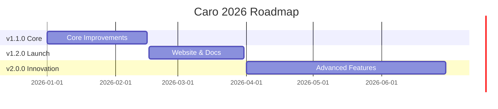
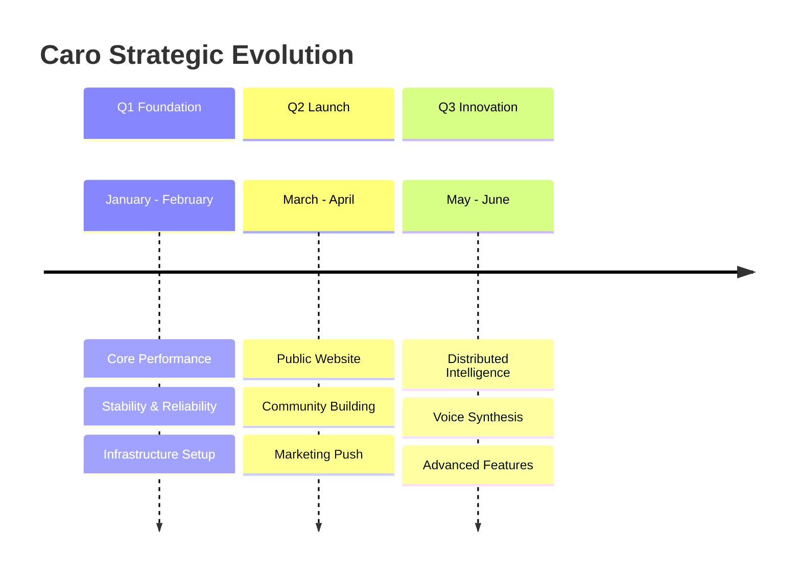

# Caro Roadmap 2026

### Building the Future of Safe AI-Powered Shell

  
    v1.1.0 → v1.2.0 → v2.0.0
  

  <a href="https://github.com/wildcard/caro" target="_blank" alt="GitHub"
    class="text-xl slidev-icon-btn opacity-50 !border-none !hover:text-white">
    <carbon-logo-github />
  </a>

<!--
Welcome to the Caro 2026 roadmap presentation. This outlines our three major milestones for the year ahead.
-->

---
layout: center
class: text-center
---

# Where We Are Today

<v-clicks>

🎉 **v1.0.1 Released** - Production-ready CLI

📊 **Progress**: 9/60 items complete (15%)

✅ **Release Blockers**: 0

🚀 **Next**: v1.1.0 Core Improvements

</v-clicks>

<!--
We've successfully shipped v1.0.1 with core functionality working. Now we're ready to accelerate development across three strategic milestones.
-->

---
layout: center
---

# Timeline Overview

  <v-clicks>

  - **Q1**: Foundation & Performance
  - **Q2**: Public Launch & Community
  - **Q3**: Innovation & Advanced AI

  </v-clicks>

<!--
Three distinct phases over the first half of 2026, each building on the previous milestone.
-->

---
layout: two-cols
---

# v1.1.0
## Core Improvements

<v-clicks>

📅 **Due**: February 15, 2026
📊 **Progress**: 7% (1/15 complete)
⏰ **48 days away**

**Key Deliverables:**

- 🤗 Hugging Face model download
- ⚡ Performance analysis & optimization
- 🧪 LLM evaluation harness
- 📊 Benchmark suite
- 🛡️ Safety enhancements

</v-clicks>

::right::

## Success Criteria

<v-clicks>

✅ **All critical bugs resolved**

⚡ **Performance benchmarks established**
- < 100ms startup time
- < 2s first inference on M1

📦 **Stable HF model download**
- Offline capability
- Model caching working

🧪 **Comprehensive test coverage**
- Property-based tests
- Integration test suite

</v-clicks>

<!--
Foundation phase focusing on production-ready core. Performance and reliability are key.
-->

---
layout: center
---

# v1.1.0 Focus Areas

<v-clicks>

  <h3 class="text-2xl mb-4">🚀 Performance</h3>
  <ul class="text-sm space-y-2">
    <li>Startup time optimization</li>
    <li>Lazy loading improvements</li>
    <li>Memory usage profiling</li>
    <li>Benchmark infrastructure</li>
  </ul>

  <h3 class="text-2xl mb-4">🛡️ Safety</h3>
  <ul class="text-sm space-y-2">
    <li>Enhanced pattern matching</li>
    <li>POSIX compliance checks</li>
    <li>Risk assessment refinement</li>
    <li>User confirmation flows</li>
  </ul>

  <h3 class="text-2xl mb-4">📦 Infrastructure</h3>
  <ul class="text-sm space-y-2">
    <li>HF model integration</li>
    <li>Automated GitHub releases</li>
    <li>Local directory context</li>
    <li>Self-healing features</li>
  </ul>

  <h3 class="text-2xl mb-4">🧪 Testing</h3>
  <ul class="text-sm space-y-2">
    <li>LLM evaluation harness</li>
    <li>Property-based tests</li>
    <li>Advanced tool use patterns</li>
    <li>Local Chroma DB indexing</li>
  </ul>

</v-clicks>

<!--
Four key focus areas for v1.1.0, each critical for production readiness.
-->

---
layout: two-cols
---

# v1.2.0
## Website & Docs Launch

<v-clicks>

📅 **Due**: March 31, 2026
📊 **Progress**: 0% (0/24 complete)
⏰ **93 days away**

**Key Deliverables:**

- 🌐 Interactive terminal landing page
- 📚 Astro Starlight docs site
- 🎯 Marketing materials
- 🗺️ Strategic product roadmap
- 🌏 Simplified Chinese translation

</v-clicks>

::right::

## Success Criteria

<v-clicks>

✅ **Professional website live**
- caro.sh domain active
- Interactive terminal demo
- SEO optimized

📚 **Comprehensive docs available**
- Installation guides
- API documentation
- Usage examples

🎯 **Marketing ready**
- Multi-channel announcement
- UGC content pipeline
- Community channels

🌍 **Community engaged**
- GitHub discussions active
- Attribution page live
- i18n support started

</v-clicks>

<!--
Public launch phase - establishing professional presence and building community.
-->

---
layout: center
---

# v1.2.0 Deliverables

<v-clicks>

  <h4 class="text-lg mb-3">🌐 Website</h4>
  <ul class="text-xs space-y-1">
    <li>Terminal landing page</li>
    <li>ASCII art morphs</li>
    <li>Value proposition</li>
    <li>SEO & social meta</li>
    <li>Florentine design</li>
  </ul>

  <h4 class="text-lg mb-3">📚 Documentation</h4>
  <ul class="text-xs space-y-1">
    <li>Astro Starlight site</li>
    <li>Comprehensive manual</li>
    <li>LLM architecture docs</li>
    <li>OSS building guide</li>
    <li>Dependency mgmt guide</li>
  </ul>

  <h4 class="text-lg mb-3">🎯 Strategy</h4>
  <ul class="text-xs space-y-1">
    <li>12-month roadmap</li>
    <li>Launch strategy</li>
    <li>UGC content pipeline</li>
    <li>Multi-channel plan</li>
    <li>Batteries philosophy</li>
  </ul>

  <h4 class="text-lg mb-3">🌍 Community</h4>
  <ul class="text-xs space-y-1">
    <li>Mission & values</li>
    <li>Attribution page</li>
    <li>Simplified Chinese</li>
    <li>NixOS explore page</li>
    <li>Post-launch campaign</li>
  </ul>

  <h4 class="text-lg mb-3">🎨 Content</h4>
  <ul class="text-xs space-y-1">
    <li>Interactive MediaPipe</li>
    <li>AI shell pitch deck</li>
    <li>SIGMA_AGENT docs</li>
    <li>Product manager docs</li>
  </ul>

  <h4 class="text-lg mb-3">⚙️ DevOps</h4>
  <ul class="text-xs space-y-1">
    <li>Automated releases</li>
    <li>CI/CD pipeline</li>
    <li>GitHub workflows</li>
  </ul>

</v-clicks>

<!--
Comprehensive launch across 6 key areas - website, docs, strategy, community, content, and devops.
-->

---
layout: two-cols
---

# v2.0.0
## Advanced Features

<v-clicks>

📅 **Due**: June 30, 2026
📊 **Progress**: 38% (8/21 complete)
⏰ **184 days away**

**Key Deliverables:**

- 🧠 Karo distributed intelligence
- 🎙️ Voice synthesis for Caro
- 🔒 Dogma rule engine
- 🌐 Exo cluster support
- 🔧 Self-healing features

</v-clicks>

::right::

## Success Criteria

<v-clicks>

✅ **Distributed intelligence working**
- Karo prototype functional
- Jazz cross-device sync
- Multi-terminal coordination

🎙️ **Voice synthesis integrated**
- Caro character voice
- Natural speech output
- Audio feedback system

🔒 **Advanced safety operational**
- Dogma rule engine live
- Security hardening complete
- Policy enforcement active

🚀 **Innovation platform ready**
- Advanced tool patterns
- Next-gen capabilities
- Research validated

</v-clicks>

<!--
Innovation phase - exploring cutting-edge AI features and distributed intelligence.
-->

---
layout: center
---

# v2.0.0 Innovation Areas

<v-clicks>

  <h3 class="text-2xl mb-4">🧠 Distributed Intelligence</h3>
  <ul class="text-sm space-y-2">
    <li><strong>Karo System</strong>: Multi-terminal coordination</li>
    <li><strong>Jazz Integration</strong>: Cross-device sync</li>
    <li><strong>Shared Context</strong>: Persistent intelligence</li>
    <li><strong>Team Collaboration</strong>: Shared AI assistant</li>
  </ul>

  <h3 class="text-2xl mb-4">🎙️ Voice & Character</h3>
  <ul class="text-sm space-y-2">
    <li><strong>Voice Synthesis</strong>: Natural Caro voice</li>
    <li><strong>Character Development</strong>: Personality traits</li>
    <li><strong>Audio Feedback</strong>: Spoken responses</li>
    <li><strong>Yappus-Term</strong>: Voice-first interface</li>
  </ul>

  <h3 class="text-2xl mb-4">🔒 Safety & Rules</h3>
  <ul class="text-sm space-y-2">
    <li><strong>Dogma Engine</strong>: Advanced rule system</li>
    <li><strong>Security Hardening</strong>: Threat protection</li>
    <li><strong>Policy Enforcement</strong>: Organization rules</li>
    <li><strong>Audit Trails</strong>: Command tracking</li>
  </ul>

  <h3 class="text-2xl mb-4">⚡ Advanced AI</h3>
  <ul class="text-sm space-y-2">
    <li><strong>Exo Clusters</strong>: Distributed inference</li>
    <li><strong>Tool Patterns</strong>: Complex workflows</li>
    <li><strong>Self-Healing</strong>: Auto error recovery</li>
    <li><strong>Context Indexing</strong>: Smart caching</li>
  </ul>

</v-clicks>

<!--
Four innovation pillars for v2.0.0 - each pushing the boundaries of what's possible.
-->

---
layout: center
---

# Strategic Themes for 2026

<v-clicks>

- **Q1**: Build solid foundation with performance & safety
- **Q2**: Launch publicly with docs & marketing
- **Q3**: Innovate with distributed AI & voice features

</v-clicks>

<!--
Three quarters, three themes - foundation, launch, innovation. Each builds on the previous.
-->

---
layout: center
---

# Progress Dashboard

<v-clicks>

  
7%

  
v1.1.0

  
1/15 complete

  
48 days remaining

  
0%

  
v1.2.0

  
0/24 complete

  
93 days remaining

  
38%

  
v2.0.0

  
8/21 complete

  
184 days remaining

</v-clicks>

<v-clicks>

**Overall Progress**: 9/60 items complete (15%)

**No Release Blockers** 🎉

</v-clicks>

<!--
Current status across all three milestones. v2.0.0 leading with early research work.
-->

---
layout: two-cols
---

# Get Involved

<v-clicks>

## 🚀 GitHub Projects

**Product Development**
Technical work, core CLI features, backend integrations
→ [Project Board](https://github.com/users/wildcard/projects/2)

**Marketing & DevRel**
Website, docs, marketing, community
→ [Project Board](https://github.com/users/wildcard/projects/3)

## 🎯 Find Your Task

Use `/caro.roadmap next` to get the highest-priority work item matched to your expertise.

</v-clicks>

::right::

## 📚 Resources

<v-clicks>

**Documentation**
- [ROADMAP.md](https://github.com/wildcard/caro/blob/main/ROADMAP.md)
- [CONTRIBUTING.md](https://github.com/wildcard/caro/blob/main/CONTRIBUTING.md)
- [CLAUDE.md](https://github.com/wildcard/caro/blob/main/CLAUDE.md)

**Quick Links**
- [All Milestones](https://github.com/wildcard/caro/milestones)
- [All Issues](https://github.com/wildcard/caro/issues)
- [Pull Requests](https://github.com/wildcard/caro/pulls)

**Labels to Watch**
- `good first issue`
- `help wanted`
- `release-blocker`

</v-clicks>

<!--
Multiple ways to contribute - pick what matches your interests and expertise.
-->

---
layout: end
class: text-center
---

# Let's Build the Future Together

  

  <v-clicks>

  **Caro** - Safe AI-Powered Shell

  github.com/wildcard/caro

  </v-clicks>

  <v-clicks>

  Questions? Open an issue or discussion on GitHub

  Ready to contribute? Check `/caro.roadmap next` for recommended work

  </v-clicks>

<!--
Thank you! We're excited to build Caro with the community in 2026.
-->
