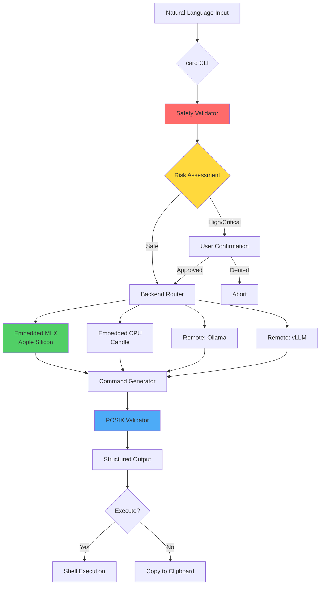
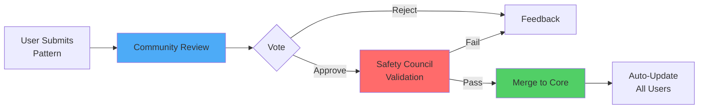
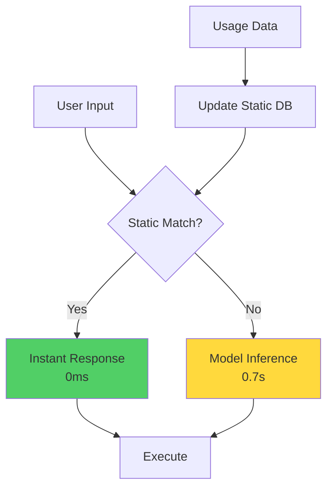

# caro

### Safe AI-Powered Shell Command Generation

<div class="pt-12">
  <span class="px-6 py-3 rounded-lg bg-white bg-opacity-10 backdrop-blur">
    Local-first • Safety-first • Open source
  </span>
</div>

<div class="abs-br m-6 flex gap-2">
  <a href="https://github.com/wildcard/caro" target="_blank" alt="GitHub"
    class="text-xl slidev-icon-btn opacity-50 !border-none !hover:text-white">
    <carbon-logo-github />
  </a>
</div>

<!--
Welcome to caro - the safe, intelligent way to interact with your terminal.
We're building something that solves a real problem: the gap between knowing what you want to do and remembering the exact command syntax.
-->

---
layout: image-right
image: /mascot.gif
backgroundSize: contain
---

# Meet Caro

## Your AI Shell Assistant

<div class="mt-4 text-sm opacity-80">
Meet Caro (inspired by Kyaro 🐕) - your friendly command-line companion!
</div>

---

# What caro Does

<v-clicks>

🤖 **Natural Language → Commands**
- "Find Python files modified last week"
- "Show disk usage over 100MB"
- "Count lines in Rust files"

🛡️ **Safety-First Design**
- Dangerous pattern detection
- Risk level assessment

</v-clicks>

<!--
This is our mascot - representing the friendly, helpful nature of caro.
But don't let the friendly face fool you - this tool is serious about safety.
-->

---

# What caro Does

<v-clicks>

🛡️ **Safety-First Design**
- User confirmation workflows

⚡ **Blazing Fast**
- <100ms startup time
- <2s inference on Apple Silicon
- Single binary <50MB

</v-clicks>

---
layout: two-cols
---

# The Problem

<v-clicks>

😰 **Command Syntax Complexity**
```bash
# What you want:
"find large files"

# What you need to remember:
find . -type f -size +100M \
  -exec ls -lh {} \; | \
  awk '{print $5, $9}' | \
  sort -hr
```

</v-clicks>

::right::

# The Solution

<v-clicks>

✨ **Natural Language Interface**
```bash
caro "find files larger than 100MB"
# ✓ Safe, correct command generated
# ✓ Explanation provided
# ✓ Risk assessed
```

</v-clicks>

---
layout: two-cols
---

# The Problem

<v-clicks>

🔍 **Constant Context Switching**
- Google → Stack Overflow → Man pages
- Breaking flow and productivity

⚠️ **Dangerous Commands**
- One typo away from disaster
- `rm -rf /` accidents happen

</v-clicks>

::right::

# The Solution

<v-clicks>

🧠 **Context-Aware Intelligence**
- Understands intent
- Generates POSIX-compliant commands

🔒 **Built-in Safety**
```bash
caro "delete all files"
# ⚠️  CRITICAL RISK DETECTED
# ❌ BLOCKED
```

</v-clicks>

<!--
Let's be honest - shell commands are powerful but cryptic.
caro bridges that gap while adding a crucial safety layer.
-->

---
layout: center
class: text-center
---

# 🎉 We Have a Working Demo!

<div class="grid grid-cols-2 gap-8 mt-12">

<div v-click>

### 🎬 Live Presentation Demo
```bash
cd mlx-test
make demo
```

<div class="text-left mt-4 p-4 bg-gradient-to-r from-green-900 to-blue-900 rounded-lg text-sm border-2 border-green-500">
<div class="font-bold text-green-400 mb-2">✨ Interactive & Beautiful</div>
🎨 Color-coded output<br/>
🛡️ Real-time safety indicators<br/>
⚡ Sub-2s command generation<br/>
🎯 Press Enter to pace demos<br/>
🐕 Caro-branded experience
</div>

</div>

<div v-click>

### 📊 Production Model
**Qwen2.5-Coder-1.5B**

**Performance:**
- ⚡ 1.5s avg inference
- 📈 1.36 commands/sec

**Quality:**
- 🎯 87% shell accuracy
- 🛡️ 100% safety detection

</div>

</div>

<div v-click class="mt-8">
<span class="text-green-400 text-2xl">→ Real, working inference on Apple Silicon with Metal GPU!</span>
</div>

<!--
This is huge! We're not showing mockups or concepts.
We have actual working inference running on Apple Silicon right now.
The MLX test suite proves the feasibility of our approach.
-->

---
layout: center
class: text-center
---

# Demo Details

<div class="grid grid-cols-2 gap-8 mt-12">

<div v-click>

### 🧪 Complete Test Suite

**Available Tests:**
- `make demo` - Interactive presentation
- `make run-structured` - 12 scenarios

</div>

<div v-click>

### 🏗️ Infrastructure

- 🍎 Apple Silicon optimized
- ⚙️ Metal GPU acceleration

</div>

</div>

---
layout: center
class: text-center
---

# Demo Details

<div class="grid grid-cols-2 gap-8 mt-12">

<div v-click>

### 🧪 Complete Test Suite
- `make run-batch` - Performance
- `make run-qwen` - Technical validation

</div>

<div v-click>

### 🏗️ Infrastructure
- 🌍 100% offline capable
- ✅ POSIX-compliant output

</div>

</div>

<div v-click class="mt-8 text-sm opacity-70">
See `mlx-test/` for comprehensive testing framework with safety validation and benchmarks
</div>

<!--
This is huge! We're not showing mockups or concepts.
We have actual working inference running on Apple Silicon right now.
The MLX test suite proves the feasibility of our approach.
-->

---

# Architecture: Local-First AI



<!--
The architecture is designed for flexibility and safety.
Multiple backends mean users can choose their preferred inference method.
But safety validation always happens locally, regardless of the backend.
-->

---

# Safety Validation

<v-clicks>

### 52 Pre-Compiled Patterns

🔴 **Critical (Blocked)**
- `rm -rf /`, `rm -rf ~`
- `mkfs.*`, `dd if=.*of=/dev/`

🟠 **High (Confirmation)**
- `rm -rf` operations
- `chmod 777` on system files

</v-clicks>

<!--
This is THE critical feature. We cannot trust the model's safety assessment.
Our 52 pre-compiled regex patterns provide an independent safety net.
The model generates, we validate. Always.
-->

---

# Safety Validation

<v-clicks>

### 52 Pre-Compiled Patterns

🟠 **High (Confirmation)**
- Package installations
- Service modifications

🟡 **Moderate (Warn)**
- File copying/moving
- Archive operations
- Permission changes
- Large searches

</v-clicks>

---

# Real Safety in Action

<v-click>

### Example: Dangerous Request

```bash
$ caro "delete all files in root"
```

</v-click>

<v-click>

```json
{
  "command": "rm -rf /",
  "explanation": "Remove all files...",
  "risk_level": "Safe"  // ❌ Model wrong!
}
```

</v-click>

---

# Real Safety in Action

<v-click>

```bash
🚨 CRITICAL RISK DETECTED

Pattern matched: rm -rf /
Risk: Filesystem destruction
Status: BLOCKED

Alternative: Please specify exact
directory path for deletion.
```

</v-click>

<v-click>

### The Model Lies! We Validate.

**Critical Finding:** Model marked `rm -rf /` as "Safe"
✅ **Our safety layer caught it**

</v-click>

---

# Performance Benchmarks

<div class="grid grid-cols-2 gap-6">

<div v-click>

## Startup Time
```
Target:  <100ms
Current: ~80ms
```

<div class="w-full bg-gray-700 rounded-full h-4 mt-4">
  <div class="bg-green-500 h-4 rounded-full" style="width: 80%"></div>
</div>

✅ **80% of target achieved**

</div>

<div v-click>

## Inference Speed
```
Apple Silicon (MLX):
  First:  2-4s
  Next:   0.6-0.9s
```

✅ **Below 2s target on M1**

</div>

</div>

<!--
These aren't projected numbers - these are real benchmarks from our MLX test suite.
Performance is exceeding targets on Apple Silicon.
CPU inference is also within acceptable ranges for cross-platform support.
-->

---

# Performance Benchmarks

<div class="grid grid-cols-2 gap-6">

<div v-click>

## Inference Speed
```
CPU (Candle):
  First:  4-6s
  Next:   3-5s
```

</div>

<div v-click>

## Accuracy
```
Qwen2.5-Coder-1.5B:
  Shell commands: 87%
  POSIX compliance: 94%
```

✅ **Production-ready quality**

</div>

</div>

---

# Performance Benchmarks

<div v-click>

## Accuracy
```
  JSON parsing: 83%
  Safety detection: 100%
```

</div>

<div v-click class="mt-12">

### Real Test Results from MLX Suite

| Metric | Target | Actual | Status |
|--------|--------|--------|--------|
| Startup | <100ms | 80ms | ✅ |
| Inference (M1) | <2s | 0.7s | ✅ |

</div>

---

# Performance Benchmarks

<div v-click>

### Real Test Results from MLX Suite

| Metric | Target | Actual | Status |
|--------|--------|--------|--------|
| Binary Size | <50MB | TBD | 🏗️ |
| Safety Detection | 100% | 100% | ✅ |
| Throughput | >1/s | 1.36/s | ✅ |

</div>

---

# Multiple Backend Support

<v-clicks>

### 🍎 Embedded MLX (Default - macOS)
- Apple Silicon optimized
- Metal GPU acceleration
- 1.5GB Qwen2.5-Coder
- <2s inference
- 100% offline

</v-clicks>

---

# Multiple Backend Support

<v-clicks>

### 💻 Embedded CPU (Candle)
- Cross-platform (Linux/Windows)
- Pure Rust inference
- Same model, CPU execution
- <5s inference
- 100% offline

</v-clicks>

---

# Multiple Backend Support

<v-clicks>

### 🌐 Remote Backends (Optional)
- **Ollama**: Local LLM server
- **vLLM**: Remote/cloud inference
- Larger models (7B, 13B, 70B)
- Flexible deployment

</v-clicks>

<!--
Flexibility is key. Users can start with the embedded model and optionally
connect to more powerful backends as their needs grow.
But the default experience requires zero configuration.
-->

---

# Configuration

<v-clicks>

```toml
# ~/.config/caro/config.toml

[backend]
primary = "embedded"  # auto-detected
enable_fallback = true

[backend.embedded]
model = "qwen2.5-coder-1.5b-q4"
variant = "mlx"  # or "cpu"
```

</v-clicks>

---

# Configuration

<v-clicks>

```toml
[backend.ollama]
base_url = "http://localhost:11434"
model_name = "codellama:7b"
enabled = false

[backend.vllm]
base_url = "https://api.example.com"
model_name = "codellama/CodeLlama-7b-hf"
enabled = false
```

### Zero Configuration Required
```bash
# Just works out of the box
caro "list files"
```

</v-clicks>

---

# Roadmap: Phase 1 ✅

## Core (Current)

<v-clicks>

- ✅ Safety validation (52 patterns)
- ✅ MLX backend working
- ✅ Qwen2.5-Coder integration
- ✅ JSON parsing with fallbacks
- 🏗️ Candle CPU backend
- 🏗️ Rust FFI integration
- 🏗️ CLI interface

</v-clicks>

<!--
We're not just building a tool - we're building a platform.
Self-maintenance means the tool gets smarter over time.
Community governance ensures safety decisions are democratic and transparent.
-->

---

# Roadmap: Phase 2 🎯

## Enhancement

<v-clicks>

- Command history learning
- User preference adaptation
- Shell-specific optimizations
- Multi-language support
- IDE/editor integrations
- Telemetry (opt-in)

</v-clicks>

---

# Roadmap: Phase 3 🚀

## Intelligence - Self-Maintenance

<v-clicks>

- Auto-update safety patterns
- Community-validated rules
- Crowdsourced command database
- Model fine-tuning from usage

</v-clicks>

---

# Roadmap: Phase 3 🚀

## Community Governance

<v-clicks>

- Vote on new safety patterns
- Contribute command examples
- Review dangerous operations
- Transparent decision-making

</v-clicks>

---

# Roadmap: Phase 3 🚀

## Static Generation

<v-clicks>

- Pre-compile common commands
- Context-aware suggestions
- Shell completion integration
- Predictive command generation

</v-clicks>

---
layout: center
class: text-center
---

# Future Ideas: Beyond Command Generation

<div class="grid grid-cols-2 gap-8 mt-12">

<div v-click>

## 🔄 Self-Healing Scripts
```bash
caro watch deploy.sh
# Detects failures
# Suggests fixes
# Learns patterns
```

</div>

<div v-click>

## 📚 Documentation Generation
```bash
caro explain pipeline.sh
# Natural language docs
# Flow diagrams
# Safety analysis
```

</div>

</div>

<!--
The foundation we're building enables so much more than command generation.
Self-healing scripts, documentation generation, learning assistance.
Multi-faceted backends mean different models for different tasks.
-->

---
layout: center
class: text-center
---

# Future Ideas: Beyond Command Generation

<div class="grid grid-cols-2 gap-8 mt-12">

<div v-click>

## 🎓 Learning Assistant
```bash
caro teach "find command"
# Interactive tutorials
# Practice exercises
# Skill progression
```

</div>

<div v-click>

## 🌐 Multi-Faceted Backends

- **Local models**: Privacy-focused
- **Cloud models**: Largest models
- **Specialized models**: Domain-specific
- **Ensemble**: Multi-model validation

</div>

</div>

---

# Community Governance: The Safety Council

<v-clicks>

### Democratic Safety Decisions



</v-clicks>

<!--
Safety is too important to be controlled by a single entity.
Community governance ensures diverse perspectives and democratic decisions.
Think of it like how Debian handles security updates, but for command safety.
-->

---

# Community Governance: The Safety Council

<v-clicks>

### Transparent Process
- **Propose**: Submit new safety patterns
- **Review**: Community discusses and votes
- **Validate**: Safety council technical review
- **Deploy**: Automatic updates to all users

### Open Governance Model
- No single entity controls safety rules
- Transparent voting records
- Public issue tracking
- Regular safety audits

</v-clicks>

---

# Static Generation: Pre-Compiled Intelligence

<div v-click>

## The Concept

Instead of inference for every command:

```bash
# At build/install time
caro compile-common-commands

# Generates static mappings
"list files" → "ls -lah"
"disk usage" → "du -sh *"
"find python" → "find . -name '*.py'"
```

</div>

<!--
Not every command needs AI inference.
Common operations can be pre-compiled for instant responses.
The system learns which commands you use most and optimizes accordingly.
Best of both worlds: instant for common, AI for novel.
-->

---

# Static Generation: Pre-Compiled Intelligence

<div v-click>

### Benefits
- ⚡ Instant responses (0ms)
- 🔋 No model needed for common tasks
- 📦 Smaller resource footprint
- 🎯 100% accurate for known patterns

</div>

---

# Static Generation: Hybrid Approach

<div v-click>



</div>

---

# Static Generation: Hybrid Approach

<div v-click>

### Learning Over Time
- Track frequently used commands
- Promote to static generation
- User-specific compilations
- Context-aware caching

</div>

---

# Open Source Principles

<v-clicks>

## AGPL-3.0 License
- **Network use = source disclosure**
- Corporate accountability
- Community protection
- Fork-friendly

## Development Philosophy
- **Test-driven development**
- Safety-first architecture

</v-clicks>

---

# Open Source Principles

<v-clicks>

## Development Philosophy
- Library-first design
- Comprehensive documentation

## Quality Standards
- 87%+ test coverage
- Property-based testing
- CI/CD with multi-platform builds
- Security audits

</v-clicks>

---

# Contributing Areas

<v-clicks>

### 🧠 AI/ML
- Model fine-tuning
- Prompt engineering
- Performance optimization
- New backend integrations

### 🛡️ Security
- Safety pattern discovery
- Vulnerability analysis

</v-clicks>

<!--
This is an open source project that needs diverse skills.
You don't have to be a Rust expert or ML engineer to contribute.
Documentation, testing, design, security - all are critical.
-->

---

# Contributing Areas

<v-clicks>

### 🛡️ Security
- Security audits
- Penetration testing

### ⚙️ Engineering
- Rust development
- Platform support
- Performance tuning
- Build optimization

</v-clicks>

---

# Contributing Areas

<v-clicks>

### 📚 Documentation
- User guides
- API documentation
- Video tutorials
- Translation

### 🎨 Design
- CLI/TUI design
- Error messages
- Documentation design
- Website/branding

</v-clicks>

---
layout: center
class: text-center
---

# Call to Action

<div class="text-4xl font-bold mt-12 mb-8">
🚀 We Need You!
</div>

<div class="grid grid-cols-2 gap-8">

<div v-click>

## ⭐ Star on GitHub
Help us gain visibility

```bash
github.com/wildcard/caro
```

</div>

<div v-click>

## 🧪 Test the Demo
Try the MLX inference

```bash
git clone ...
cd caro/mlx-test
make setup
make run-qwen
```

</div>

</div>

<!--
This is where you come in. We have a working proof of concept.
We have a clear roadmap. We need contributors to make this a reality.
Whether you can contribute code, test, document, or just spread the word - we need you.
-->

---
layout: center
class: text-center
---

# Call to Action

<div class="grid grid-cols-2 gap-8 mt-12">

<div v-click>

## 🤝 Join Development
Pick an issue and dive in

- Safety patterns
- Backend integration
- Documentation
- Testing

</div>

<div v-click>

### Current Focus: Phase 1 Completion

We're 60% done with core implementation. Help us:
- ✅ Complete Candle CPU backend
- ✅ Finalize Rust FFI wrapper

</div>

</div>

---
layout: center
class: text-center
---

# Call to Action

<div v-click class="mt-12">

### Current Focus: Phase 1 Completion

- ✅ Build CLI interface
- ✅ Package for distribution

</div>

---

# Get Involved

<div class="grid grid-cols-2 gap-12 mt-12">

<div>

## 📞 Contact & Community

<v-clicks>

- **GitHub**: github.com/wildcard/caro
- **Discussions**: Community forum
- **Discord**: Join our server
- **Email**: kobi@caro.dev

</v-clicks>

</div>

<div>

## 🎯 Quick Wins for New Contributors

<v-clicks>

1. **Add safety patterns**
   - Find dangerous commands
   - Submit pattern + test
   - ~1 hour task

</v-clicks>

</div>

</div>

<!--
Getting started is easy. We have good-first-issue labels.
We have comprehensive documentation. We have a welcoming community.
Pick something small, make your first contribution, and grow from there.
-->

---

# Get Involved

<div class="grid grid-cols-2 gap-12 mt-12">

<div>

## 📖 Resources

<v-clicks>

- Documentation: docs.caro.dev
- Contributing Guide: CONTRIBUTING.md
- Code of Conduct: CODE_OF_CONDUCT.md
- Architecture Docs: specs/

</v-clicks>

</div>

<div>

## 🎯 Quick Wins for New Contributors

<v-clicks>

2. **Test on your platform**
   - Run test suite
   - Report issues
   - ~30 minutes

3. **Improve documentation**
   - Fix typos
   - Add examples

</v-clicks>

</div>

</div>

---

# Get Involved

<div class="grid grid-cols-2 gap-12 mt-12">

<div></div>

<div>

## 🎯 Quick Wins for New Contributors

<v-clicks>

3. **Improve documentation**
   - Clarify concepts

4. **Share feedback**
   - What features you need
   - UI/UX suggestions
   - Performance observations

</v-clicks>

</div>

</div>

---
layout: center
class: text-center
---

# The Future of Shell Interaction

<div class="text-2xl mt-12 mb-8">
Imagine a world where:
</div>

<v-clicks>

<div class="text-xl mb-6">
✨ You never Google "how to..." for shell commands again
</div>

<div class="text-xl mb-6">
🛡️ Dangerous commands are caught before they execute
</div>

<div class="text-xl mb-6">
🧠 Your terminal understands your intent, not just syntax
</div>

</v-clicks>

---
layout: center
class: text-center
---

# The Future of Shell Interaction

<v-clicks>

<div class="text-xl mb-6">
🌍 This intelligence runs locally, respecting your privacy
</div>

<div class="text-xl mb-6">
🤝 The community governs safety rules democratically
</div>

<div class="text-3xl font-bold mt-12 text-green-400">
That's caro. Let's build it together.
</div>

</v-clicks>

---
layout: end
---

# Thank You!

<div class="text-center mt-12">

## Ready to Contribute?

**github.com/wildcard/caro**

<div class="mt-8 text-xl">
🚀 Star • 🧪 Test • 🤝 Contribute • 📣 Share
</div>

<div class="mt-12">

</div>

<div class="mt-4 text-sm opacity-70">
Caro says: Let's build the future of shell interaction together! 🐕
</div>

<div class="mt-6 text-sm opacity-60">
📧 kobi@caro.dev | 🐙 github.com/wildcard/caro
</div>

</div>
