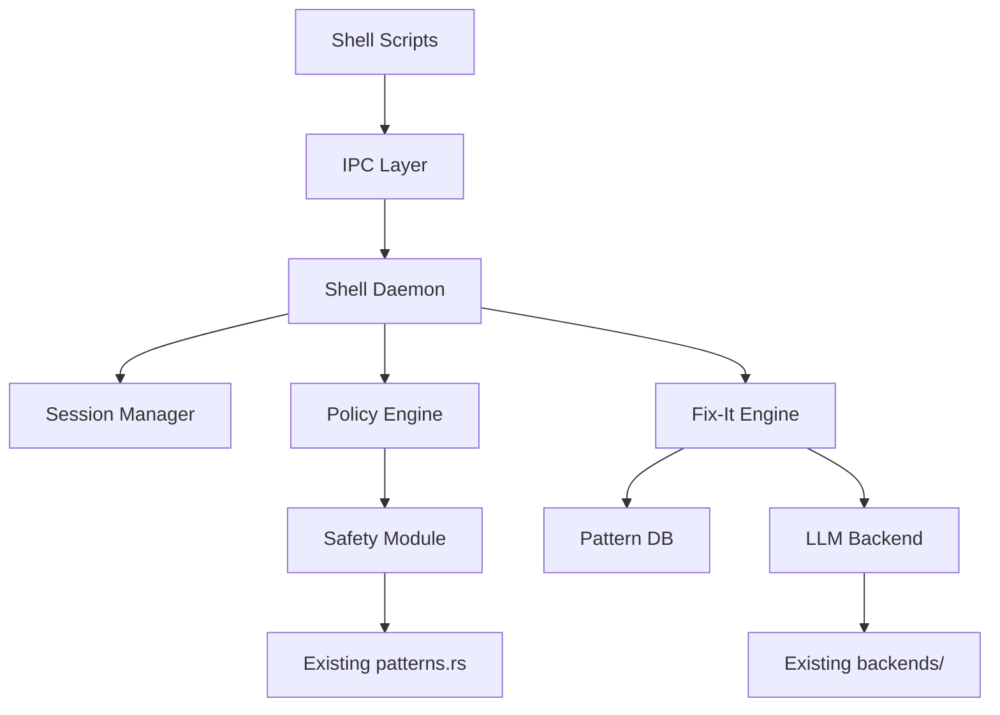

# Caro Shell Integration - Implementation Plan

## Repository Structure

### New Modules
```
caro/
├── src/
│   ├── shell/                     # NEW: Shell integration module
│   │   ├── mod.rs                 # Module entry point
│   │   ├── daemon.rs              # Caro shell daemon
│   │   ├── session.rs             # Per-session state management
│   │   ├── ipc/
│   │   │   ├── mod.rs             # IPC abstraction
│   │   │   ├── socket.rs          # Unix socket server
│   │   │   └── protocol.rs        # Message protocol (JSON)
│   │   ├── hooks/
│   │   │   ├── mod.rs             # Hook event processing
│   │   │   ├── preexec.rs         # Pre-execution handler
│   │   │   ├── postcmd.rs         # Post-command handler
│   │   │   └── keybind.rs         # Keybinding handler
│   │   ├── policy/
│   │   │   ├── mod.rs             # Policy engine
│   │   │   ├── rules.rs           # Safety rules
│   │   │   └── actions.rs         # Policy actions
│   │   ├── fixit/
│   │   │   ├── mod.rs             # Fix-it engine
│   │   │   ├── patterns.rs        # Error pattern database
│   │   │   └── corrections.rs     # Correction suggestions
│   │   └── ui/
│   │       ├── mod.rs             # Terminal UI
│   │       ├── prompt.rs          # Simple TTY prompts
│   │       └── colors.rs          # Color output
│   │
│   ├── main.rs                    # Existing CLI (unchanged)
│   └── lib.rs                     # Add shell module export
│
├── shell-scripts/                 # NEW: Shell integration scripts
│   ├── bash.init                  # bash integration
│   ├── zsh.init                   # zsh integration
│   ├── sh.init                    # POSIX sh fallback
│   ├── fish/
│   │   ├── conf.d/
│   │   │   └── caro.fish          # Auto-loaded config
│   │   └── functions/
│   │       ├── __caro_preexec.fish
│   │       ├── __caro_postcmd.fish
│   │       └── __caro_invoke.fish
│   └── common.sh                  # Shared POSIX functions
│
├── caro-shell/                    # NEW: Shell hook binary (optional)
│   ├── Cargo.toml                 # Lightweight binary for IPC
│   └── src/
│       └── main.rs                # Hook helper binary
│
└── tests/
    └── shell/                     # NEW: Shell integration tests
        ├── bash_test.sh
        ├── zsh_test.sh
        ├── fish_test.fish
        └── integration_test.rs
```

### Cargo Workspace Update
```toml
# Cargo.toml (workspace root)
[workspace]
members = [
    ".",
    "caro-shell",  # Lightweight IPC helper
]

# New feature flag
[features]
shell-integration = ["tokio/net"]  # Enable shell daemon
```

---

## Detailed Module Design

### 1. Shell Daemon (`src/shell/daemon.rs`)

Responsibilities:
- Listen on Unix socket for shell hook connections
- Manage multiple concurrent sessions
- Route events to appropriate handlers
- Graceful shutdown and cleanup

```rust
pub struct CaroDaemon {
    socket_path: PathBuf,
    sessions: Arc<RwLock<HashMap<SessionId, Session>>>,
    policy_engine: PolicyEngine,
    fixit_engine: FixItEngine,
    safety_validator: SafetyValidator,
}

impl CaroDaemon {
    pub async fn run(&self) -> Result<()>;
    pub async fn handle_connection(&self, stream: UnixStream) -> Result<()>;
    pub fn shutdown(&self) -> Result<()>;
}
```

### 2. Session Management (`src/shell/session.rs`)

Per-session state tracking:
```rust
pub struct Session {
    id: SessionId,
    shell_type: ShellType,
    pid: u32,
    cwd: PathBuf,
    history: VecDeque<CommandRecord>,
    last_exit_code: Option<i32>,
    created_at: DateTime<Utc>,
    last_activity: DateTime<Utc>,
}

pub struct CommandRecord {
    command: String,
    start_time: DateTime<Utc>,
    end_time: Option<DateTime<Utc>>,
    exit_code: Option<i32>,
    was_blocked: bool,
    warnings: Vec<String>,
}
```

### 3. IPC Protocol (`src/shell/ipc/protocol.rs`)

JSON-based message protocol:
```rust
#[derive(Serialize, Deserialize)]
#[serde(tag = "type")]
pub enum ShellMessage {
    // Shell -> Daemon
    SessionStart { shell_type: ShellType, pid: u32 },
    PreExec { command: String, cwd: String },
    PostCmd { exit_code: i32, duration_ms: u64 },
    KeyBind { key: String, context: KeybindContext },
    SessionEnd,

    // Daemon -> Shell
    PreExecResponse {
        allow: bool,
        warnings: Vec<String>,
        transform: Option<String>,  // Modified command
        require_confirm: bool,
    },
    PostCmdResponse {
        suggestion: Option<FixSuggestion>,
    },
    KeyBindResponse {
        action: KeybindAction,
        output: Option<String>,
    },
}

#[derive(Serialize, Deserialize)]
pub struct FixSuggestion {
    pub corrected_command: String,
    pub explanation: String,
    pub confidence: f32,
}
```

### 4. Policy Engine (`src/shell/policy/mod.rs`)

Configurable safety policies:
```rust
pub struct PolicyEngine {
    level: SafetyLevel,
    custom_rules: Vec<PolicyRule>,
    allowlist: Vec<String>,
    blocklist: Vec<String>,
}

#[derive(Clone, Copy)]
pub enum SafetyLevel {
    Off,      // No safety checks
    Passive,  // Warn only on high-risk
    Active,   // Confirm/block risky commands
}

pub struct PolicyDecision {
    pub allow: bool,
    pub warnings: Vec<String>,
    pub require_confirmation: bool,
    pub blocked_reason: Option<String>,
}
```

### 5. Fix-It Engine (`src/shell/fixit/mod.rs`)

Error correction suggestions:
```rust
pub struct FixItEngine {
    pattern_db: PatternDatabase,
    llm_backend: Option<Box<dyn ModelBackend>>,
}

impl FixItEngine {
    /// Analyze failed command and suggest fix
    pub async fn suggest_fix(
        &self,
        command: &str,
        exit_code: i32,
        stderr: Option<&str>,
    ) -> Option<FixSuggestion>;

    /// Learn from user corrections
    pub fn record_correction(&mut self, original: &str, corrected: &str);
}

/// Built-in error patterns
pub struct PatternDatabase {
    patterns: Vec<ErrorPattern>,
}

pub struct ErrorPattern {
    pub regex: Regex,
    pub exit_codes: Vec<i32>,
    pub correction_template: String,
    pub description: String,
}
```

Example patterns:
```rust
// Common error patterns
patterns! {
    // Command not found -> suggest similar
    "command not found: (\\w+)" => suggest_similar($1),

    // Permission denied -> suggest sudo
    "Permission denied" with exit_code 1 => prepend("sudo"),

    // No such file -> check typos
    "No such file or directory: (.+)" => suggest_path($1),

    // git errors
    "not a git repository" => "Run from a git repository",

    // Common typos
    "sl" => "ls",
    "gti" => "git",
    "pythno" => "python",
}
```

---

## Shell Script Implementation

### bash.init
```bash
#!/usr/bin/env bash
# Caro shell integration for bash
# Source this from ~/.bashrc

# Exit if not interactive
[[ $- != *i* ]] && return

# Exit if disabled
[[ -n "$CARO_DISABLE" ]] && return

# Configuration
CARO_SOCKET="${CARO_SOCKET:-${XDG_RUNTIME_DIR:-/tmp}/caro-$UID.sock}"
CARO_TIMEOUT="${CARO_TIMEOUT:-50}"  # ms

# State
__caro_session_id=""
__caro_last_command=""
__caro_cmd_start_time=""

# IPC helper (uses caro-shell binary or netcat fallback)
__caro_send() {
    local msg="$1"
    if command -v caro-shell >/dev/null 2>&1; then
        caro-shell send "$msg"
    elif [[ -S "$CARO_SOCKET" ]]; then
        echo "$msg" | timeout 0.05 nc -U "$CARO_SOCKET" 2>/dev/null
    fi
}

# Session initialization
__caro_init_session() {
    __caro_session_id=$(cat /proc/sys/kernel/random/uuid 2>/dev/null || date +%s%N)
    __caro_send '{"type":"SessionStart","shell_type":"bash","pid":'"$$"'}'
}

# Pre-execution hook
__caro_preexec() {
    [[ -z "$1" ]] && return
    [[ "$1" == __caro_* ]] && return  # Skip our own functions

    __caro_last_command="$1"
    __caro_cmd_start_time=$EPOCHREALTIME

    local response
    response=$(__caro_send '{"type":"PreExec","command":"'"${1//\"/\\\"}"'","cwd":"'"$PWD"'"}')

    # Parse response
    if [[ -n "$response" ]]; then
        local allow=$(echo "$response" | jq -r '.allow // true')
        local warnings=$(echo "$response" | jq -r '.warnings[]? // empty')

        if [[ "$allow" == "false" ]]; then
            echo -e "\033[31mBlocked by Caro safety\033[0m" >&2
            return 1
        fi

        if [[ -n "$warnings" ]]; then
            echo -e "\033[33mWarning:\033[0m $warnings" >&2
        fi
    fi
}

# Post-command hook
__caro_postcmd() {
    local exit_code=$?
    local duration_ms=0

    if [[ -n "$__caro_cmd_start_time" ]]; then
        local end_time=$EPOCHREALTIME
        duration_ms=$(echo "($end_time - $__caro_cmd_start_time) * 1000" | bc 2>/dev/null || echo 0)
    fi

    local response
    response=$(__caro_send '{"type":"PostCmd","exit_code":'"$exit_code"',"duration_ms":'"${duration_ms%.*}"'}')

    # Show fix suggestion if available
    if [[ -n "$response" ]] && [[ $exit_code -ne 0 ]]; then
        local suggestion=$(echo "$response" | jq -r '.suggestion.corrected_command // empty')
        if [[ -n "$suggestion" ]]; then
            echo -e "\033[36mSuggestion:\033[0m $suggestion"
            echo -e "Press \033[1mEsc Esc\033[0m to apply"
        fi
    fi

    __caro_cmd_start_time=""
    return $exit_code
}

# Caro interactive prompt
__caro_invoke() {
    echo -e "\033[1;34mCaro>\033[0m"
    read -r -p "" prompt
    if [[ -n "$prompt" ]]; then
        caro "$prompt"
    fi
}

# Apply last suggestion
__caro_apply_fix() {
    local response
    response=$(__caro_send '{"type":"GetLastFix"}')
    local fix=$(echo "$response" | jq -r '.fix // empty')
    if [[ -n "$fix" ]]; then
        READLINE_LINE="$fix"
        READLINE_POINT=${#fix}
    fi
}

# Install hooks
trap '__caro_preexec "$BASH_COMMAND"' DEBUG
PROMPT_COMMAND="__caro_postcmd${PROMPT_COMMAND:+; $PROMPT_COMMAND}"

# Install keybindings
bind -x '"\C-x\C-c": __caro_invoke'   # Ctrl+X Ctrl+C
bind -x '"\e\e": __caro_apply_fix'     # Esc Esc

# Initialize session
__caro_init_session
```

### zsh.init
```zsh
#!/usr/bin/env zsh
# Caro shell integration for zsh
# Source this from ~/.zshrc

# Exit if not interactive
[[ -o interactive ]] || return

# Exit if disabled
[[ -n "$CARO_DISABLE" ]] && return

# Load hook helper
autoload -U add-zsh-hook

# Configuration
typeset -g CARO_SOCKET="${CARO_SOCKET:-${XDG_RUNTIME_DIR:-/tmp}/caro-$UID.sock}"
typeset -g CARO_TIMEOUT=50  # ms

# State
typeset -g __caro_session_id=""
typeset -g __caro_last_command=""
typeset -g __caro_cmd_start_time=""
typeset -g __caro_last_suggestion=""

# IPC helper
__caro_send() {
    local msg="$1"
    if (( $+commands[caro-shell] )); then
        caro-shell send "$msg"
    elif [[ -S "$CARO_SOCKET" ]]; then
        print -n "$msg" | timeout 0.05 socat - UNIX-CONNECT:"$CARO_SOCKET" 2>/dev/null
    fi
}

# Session initialization
__caro_init_session() {
    __caro_session_id="${RANDOM}${RANDOM}${RANDOM}"
    __caro_send '{"type":"SessionStart","shell_type":"zsh","pid":'"$$"'}'
}

# Pre-execution hook
__caro_preexec() {
    local cmd="$1"
    [[ -z "$cmd" ]] && return
    [[ "$cmd" == __caro_* ]] && return

    __caro_last_command="$cmd"
    __caro_cmd_start_time=$EPOCHREALTIME

    local response
    response=$(__caro_send '{"type":"PreExec","command":"'"${cmd//\"/\\\"}"'","cwd":"'"$PWD"'"}')

    if [[ -n "$response" ]]; then
        local allow=$(echo "$response" | jq -r '.allow // true')
        local warnings=$(echo "$response" | jq -r '.warnings[]? // empty')
        local require_confirm=$(echo "$response" | jq -r '.require_confirm // false')

        if [[ "$allow" == "false" ]]; then
            print -P "%F{red}Blocked by Caro safety%f" >&2
            return 1
        fi

        if [[ "$require_confirm" == "true" ]]; then
            print -P "%F{yellow}Warning:%f This command may be dangerous"
            read -q "?Continue? [y/N] " || return 1
            print ""
        fi

        if [[ -n "$warnings" ]]; then
            print -P "%F{yellow}Warning:%f $warnings" >&2
        fi
    fi
}

# Post-command hook
__caro_precmd() {
    local exit_code=$?
    local duration_ms=0

    if [[ -n "$__caro_cmd_start_time" ]]; then
        local end_time=$EPOCHREALTIME
        (( duration_ms = (end_time - __caro_cmd_start_time) * 1000 ))
    fi

    local response
    response=$(__caro_send '{"type":"PostCmd","exit_code":'"$exit_code"',"duration_ms":'"${duration_ms%.*}"'}')

    # Show fix suggestion if command failed
    if [[ -n "$response" ]] && (( exit_code != 0 )); then
        local suggestion=$(echo "$response" | jq -r '.suggestion.corrected_command // empty')
        if [[ -n "$suggestion" ]]; then
            __caro_last_suggestion="$suggestion"
            print -P "%F{cyan}Suggestion:%f $suggestion"
            print -P "Press %B\e\e%b to apply"
        fi
    fi

    __caro_cmd_start_time=""
    return $exit_code
}

# ZLE widget for Caro interactive
__caro_invoke_widget() {
    local saved_buffer="$BUFFER"
    local saved_cursor="$CURSOR"

    zle kill-whole-line
    zle -R

    print -P "%B%F{blue}Caro>%f%b"
    local prompt
    read prompt

    if [[ -n "$prompt" ]]; then
        caro "$prompt"
    fi

    BUFFER="$saved_buffer"
    CURSOR="$saved_cursor"
    zle redisplay
}
zle -N __caro_invoke_widget

# ZLE widget for applying fix
__caro_apply_fix_widget() {
    if [[ -n "$__caro_last_suggestion" ]]; then
        BUFFER="$__caro_last_suggestion"
        CURSOR=${#BUFFER}
        __caro_last_suggestion=""
        zle redisplay
    fi
}
zle -N __caro_apply_fix_widget

# Install hooks
add-zsh-hook preexec __caro_preexec
add-zsh-hook precmd __caro_precmd

# Install keybindings
bindkey '^X^C' __caro_invoke_widget    # Ctrl+X Ctrl+C
bindkey '\e\e' __caro_apply_fix_widget  # Esc Esc

# Initialize session
__caro_init_session
```

### fish/conf.d/caro.fish
```fish
# Caro shell integration for fish
# Auto-loaded from ~/.config/fish/conf.d/

# Exit if not interactive
status is-interactive; or exit

# Exit if disabled
set -q CARO_DISABLE; and exit

# Configuration
set -gx CARO_SOCKET (string replace -r '$' "/caro-$USER.sock" -- (test -n "$XDG_RUNTIME_DIR"; and echo $XDG_RUNTIME_DIR; or echo /tmp))
set -g CARO_TIMEOUT 50

# State
set -g __caro_session_id ""
set -g __caro_last_command ""
set -g __caro_last_suggestion ""

# IPC helper
function __caro_send
    set -l msg $argv[1]
    if command -q caro-shell
        caro-shell send "$msg"
    else if test -S "$CARO_SOCKET"
        echo -n "$msg" | timeout 0.05 socat - UNIX-CONNECT:"$CARO_SOCKET" 2>/dev/null
    end
end

# Session initialization
function __caro_init_session
    set -g __caro_session_id (random)(random)(random)
    __caro_send '{"type":"SessionStart","shell_type":"fish","pid":'$fish_pid'}'
end

# Pre-execution hook
function __caro_preexec --on-event fish_preexec
    set -l cmd $argv[1]
    test -z "$cmd"; and return
    string match -q '__caro_*' "$cmd"; and return

    set -g __caro_last_command "$cmd"

    set -l escaped_cmd (string escape --style=json -- "$cmd")
    set -l response (__caro_send '{"type":"PreExec","command":'"$escaped_cmd"',"cwd":"'"$PWD"'"}')

    if test -n "$response"
        set -l allow (echo "$response" | jq -r '.allow // true')
        set -l warnings (echo "$response" | jq -r '.warnings[]? // empty')

        if test "$allow" = "false"
            set_color red
            echo "Blocked by Caro safety" >&2
            set_color normal
            return 1
        end

        if test -n "$warnings"
            set_color yellow
            echo "Warning: $warnings" >&2
            set_color normal
        end
    end
end

# Post-execution hook
function __caro_postexec --on-event fish_postexec
    set -l exit_code $status
    set -l duration_ms $CMD_DURATION

    set -l response (__caro_send '{"type":"PostCmd","exit_code":'$exit_code',"duration_ms":'$duration_ms'}')

    # Show fix suggestion if command failed
    if test -n "$response"; and test $exit_code -ne 0
        set -l suggestion (echo "$response" | jq -r '.suggestion.corrected_command // empty')
        if test -n "$suggestion"
            set -g __caro_last_suggestion "$suggestion"
            set_color cyan
            echo "Suggestion: $suggestion"
            set_color normal
            echo "Press "(set_color --bold)"Esc Esc"(set_color normal)" to apply"
        end
    end
end

# Caro interactive prompt
function __caro_invoke
    commandline -f kill-whole-line

    set_color --bold blue
    echo -n "Caro> "
    set_color normal

    read -l prompt
    if test -n "$prompt"
        caro "$prompt"
    end

    commandline -f repaint
end

# Apply last suggestion
function __caro_apply_fix
    if test -n "$__caro_last_suggestion"
        commandline -r "$__caro_last_suggestion"
        set -g __caro_last_suggestion ""
    end
end

# Install keybindings
bind \cx\cc __caro_invoke     # Ctrl+X Ctrl+C
bind \e\e __caro_apply_fix    # Esc Esc

# Initialize session
__caro_init_session
```

---

## IPC Choice: Unix Domain Socket

### Rationale

| Option | Pros | Cons |
|--------|------|------|
| Unix socket | Low latency, bidirectional, secure | Unix-only |
| Named pipe | Simple | One-directional, cleanup issues |
| Local HTTP | Cross-platform | Higher latency, more overhead |
| Env-based | Simple | No real-time response |

**Decision**: Unix domain socket with JSON protocol

- **Latency**: < 1ms round-trip on localhost
- **Security**: File permissions (user-only access)
- **Reliability**: OS handles cleanup on process exit
- **Bidirectional**: Supports request/response pattern

### Socket Path
```
$XDG_RUNTIME_DIR/caro-$UID.sock
  - Fallback: /tmp/caro-$UID.sock
  - Fallback: ~/.config/caro/caro.sock
```

---

## Timeout and Failure Handling

### Timeout Strategy
```
Shell hook timeout: 50ms
  - If no response in 50ms, allow command
  - Never block the shell

Daemon response timeout: 45ms
  - Leaves 5ms for IPC overhead

LLM suggestion timeout: 2000ms
  - Async, shown after command completes
```

### Failure Modes

| Failure | Behavior |
|---------|----------|
| Daemon not running | Shell works normally, no Caro features |
| Socket timeout | Allow command, log warning |
| IPC error | Allow command, disable for session |
| Invalid response | Allow command, ignore response |
| Daemon crash | Shell unaffected, auto-reconnect on next command |

### Graceful Degradation
```bash
__caro_safe_send() {
    local response
    if ! response=$(__caro_send "$1" 2>/dev/null); then
        # IPC failed, degrade gracefully
        return 0  # Allow command
    fi
    echo "$response"
}
```

---

## Runtime vs On-Demand Architecture

### Option A: Long-Running Daemon (Recommended)
```
caro daemon start   # Start daemon
caro daemon stop    # Stop daemon
caro daemon status  # Check status
```

Benefits:
- Maintains session state
- Pre-warmed LLM models
- Efficient pattern matching
- Cross-session learning

### Option B: On-Demand Execution
```
# Each hook invokes caro CLI
__caro_preexec() {
    caro shell-hook preexec "$1"
}
```

Benefits:
- Simpler architecture
- No background process

**Decision**: Start with daemon for performance, but support on-demand mode as fallback.

---

## Module Dependencies



The shell integration builds on existing caro modules:
- Reuses `SafetyValidator` from `src/safety/`
- Reuses `ModelBackend` trait from `src/backends/`
- Reuses `ShellType` and `Platform` from `src/models/`
- Reuses `ExecutionContext` from `src/execution/`
